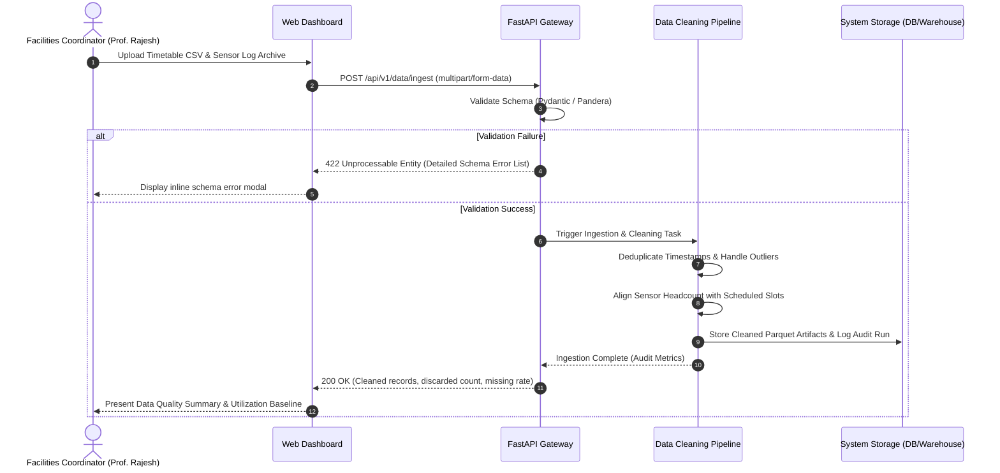
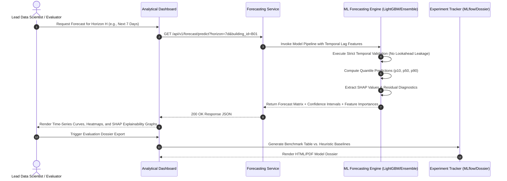
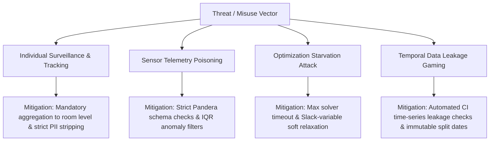

# BDS-06: Campus Occupancy Forecasting with Spatiotemporal Analytics and Capacity Optimization
## Software Requirements Specification (SRS) & Architecture Foundation
**Academic Context:** T.Y. B.Sc. Data Science – Semester V Capstone Project  
**Document Reference:** `docs/01_requirements.md`  
**Status:** Approved for Baseline Architecture  
**Author:** Lead Software Architect & Data Science Engineering Team  

> **Implementation status note (2026-10-01):** This SRS records the broad academic requirements and design target; `shall` statements are not, by themselves, proof that a feature shipped. The current implementation and verified gaps are tracked in [the requirements-to-evidence matrix](bds06_evidence_matrix.md) and [the final report](final_report.md). In particular, the served model is a one-hour XGBoost point forecast, the dashboard exposes only Overview and Forecast Explorer, and the data is synthetic. The wider multi-horizon/quantile, user-role, heatmap, and optimizer-console requirements remain partially met or deferred.

---

## 1. Executive Summary & Project Overview

### 1.1 Project Identification
- **Project Code:** BDS-06
- **Project Title:** Campus Occupancy Forecasting with Spatiotemporal Analytics and Capacity Optimization
- **Academic Degree:** Third Year Bachelor of Science in Data Science (T.Y. B.Sc. DS), Semester V
- **Domain:** Spatiotemporal Time-Series Forecasting, Operations Research (Linear/Integer Programming), MLOps, Enterprise Web Applications

### 1.2 Problem Statement
Higher education institutions routinely encounter severe imbalances in spatial resource allocation. While certain facilities (central lecture theaters, prime computer laboratories, library reading halls) experience acute overcrowding and ventilation bottlenecks during peak midday hours, peripheral classrooms, seminar rooms, and departmental annexes remain severely underutilized. Conventional scheduling relies on static course registrations without accounting for empirical attendance decay, inter-departmental timetable overlaps, commute patterns, or spatial proximity.

This results in:
1. Significant wasted energy consumption (HVAC and lighting operating in near-empty halls).
2. Friction in campus operations during scheduling surges and exam periods.
3. Inefficient capital utilization of campus real estate.

### 1.3 Proposed Solution
BDS-06 is an end-to-end, production-grade spatiotemporal analytics, predictive forecasting, and mathematical capacity optimization platform. It ingests academic timetables alongside physical occupancy sensor telemetry (Wi-Fi connection densities, passive infrared counts, and turnstile access logs), cleans and synchronizes multi-rate time series, produces calibrated multi-horizon occupancy forecasts, performs unsupervised spatial behavior clustering, and executes constraint-satisfaction room allocation optimization to maximize seat utilization and minimize energy overhead. The platform provides a production FastAPI service, an interactive analytical dashboard, an automated test harness, and fully reproducible containerized experimentation workflows.

---

## 2. Explicit Assumptions & Scope Boundaries

> [!NOTE]
> The following assumptions establish the operational baseline for this college capstone project. Any capability not explicitly stated here or in the functional requirements is considered out-of-scope for the Semester V evaluation.

### 2.1 Explicit Assumptions
- **[ASSUMPTION-01] Data Provenance & Modality:** Physical occupancy telemetry originates from IoT passive infrared (PIR) counters, optical break-beam sensors, or anonymized Wi-Fi Access Point (AP) client counts aggregated at 15-minute or 60-minute intervals. No video feeds or raw biometric sensor feeds are directly ingested.
- **[ASSUMPTION-02] Timetable Data Structure:** Academic course schedules are provided as structured tabular files (CSV/JSON/Excel) containing: `course_id`, `course_name`, `instructor_id` (pseudonymized), `enrolled_count`, `day_of_week`, `start_time`, `end_time`, `assigned_room_id`, `room_type_required`, and `academic_term`.
- **[ASSUMPTION-03] Campus Spatial Topology:** Physical rooms have static or slow-changing metadata: `room_id`, `building_id`, `floor_number`, `max_capacity`, `room_type` (Lecture Hall, Dry Lab, Wet Lab, Seminar Room, Auditorium), `has_projector`, `has_ac`, `has_specialized_hardware`, `accessible_prm` (mobility access), and campus zone coordinates (2D coordinates or building block identifier).
- **[ASSUMPTION-04] Hardware & Runtime Constraints:** The application is architected to run on commodity x86_64 hardware (minimum 4 CPU cores, 8–16 GB RAM, optional consumer-grade GPU) utilizing Docker and Docker Compose. No paid commercial cloud dependencies (e.g., AWS Bedrock, GCP Vertex AI) are mandated for grading and local demonstration.
- **[ASSUMPTION-05] Data Privacy & Compliance:** The system explicitly avoids collecting Personally Identifiable Information (PII). Student roll numbers, names, phone numbers, and device MAC addresses are completely excluded at the ingestion boundary; telemetry is strictly count-based.
- **[ASSUMPTION-06] Operational Granularity:** Spatial optimization operates at the discrete slot level (standard 60-minute academic time slots between 07:00 and 20:00, Monday through Saturday).

### 2.2 Scope Boundaries
- **In-Scope:**
  - Automated timetable ingestion and schema validation.
  - Multi-sensor occupancy cleaning, deduplication, missing-data imputation, and outlier treatment.
  - Utilization metric computation (Seat Utilization Rate, Frequency of Use, Space Wastage Index).
  - Multi-horizon forecasting (next 1-hour, next 24-hours, next 7-days) comparing statistical, tree-based (LightGBM/XGBoost), and neural baseline models.
  - Spatial and behavioral clustering of campus rooms (K-Means/HDBSCAN).
  - Mixed-Integer Linear Programming (MILP) or heuristic-guided constraint-aware room reassignment.
  - What-If scenario simulation engine (e.g., class size surges, hybrid schedule shift, offline maintenance closures).
  - Benchmark comparison against baseline heuristics (Static Timetable, Naive Historical Same-Day, Rolling Mean).
  - FastAPI REST backend with input validation and rate limiting.
  - Streamlit/React-based interactive analytics and monitoring dashboard.
  - Reproducible experiment tracking (MLflow/DVC-compatible structure).
  - Data leakage prevention suite and SHAP-based model interpretability.
  - Full Docker containerization, automated Pytest suite, and formal academic evaluation dossier.
- **Out-of-Scope:**
  - Real-time video-stream facial recognition or computer vision edge deployment.
  - Direct integration into commercial hardware HVAC building automation controllers (BACnet/Modbus hardware drivers). Recommendations are output via API/dashboard only.
  - Individual student attendance tracking or disciplinary monitoring.
  - Financial campus budgeting and tuition fee processing.

---

## 3. Stakeholders & User Personas

### 3.1 Primary Personas

#### Persona 1: Dr. Sunita Rao – Campus Space Planner & Facilities Director
- **Role:** Head of Infrastructure & Space Management
- **Goals:**
  - Identify chronically empty rooms that waste air conditioning and lighting.
  - Maximize the return on physical campus assets without forcing overcrowding.
  - Gain empirical data to justify building expansion or maintenance downtime during low-occupancy periods.
- **Pain Points:** Relies on manual paper surveys and anecdotal complaints; lacks continuous empirical metrics on seat utilization.
- **Technical Literacy:** Intermediate (Prefers visual dashboards, aggregated KPI scorecards, exportable executive PDF reports).

#### Persona 2: Prof. Rajesh Sharma – Academic Timetable & Scheduling Coordinator
- **Role:** Central Academic Timetable Officer
- **Goals:**
  - Assign courses to classrooms that comfortably fit students without violating equipment prerequisites.
  - Avoid cross-campus travel bottlenecks between back-to-back lectures for large student cohorts.
  - Run simulations before the semester begins to test timetable variants.
- **Pain Points:** Existing manual timetable allocation leads to room collisions, last-minute room swaps, and undersized lab allocations.
- **Technical Literacy:** Moderate (Proficient with Excel/CSV imports, timetable grid interfaces, and rule-based constraints).

#### Persona 3: Prof. Ananya Verma – Capstone Evaluator & Data Science Examiner
- **Role:** Academic Project Evaluator / Data Science Department Chair
- **Goals:**
  - Assess whether the project satisfies rigorous academic Data Science standards: leakage prevention, baseline benchmarking, error analysis, reproducible experiments, and clean software architecture.
  - Verify that the machine learning models demonstrably outperform simple naive rules.
  - Validate that the software engineering principles (testing, typing, containerization, API contracts) are industry-ready.
- **Pain Points:** Superficial student projects with synthetic unvalidated models, lack of validation rigor, leaked test sets, and undocumented black-box scripts.
- **Technical Literacy:** Advanced (Expert in statistical modeling, ML metrics, code review, and architectural evaluation).

#### Persona 4: Rahul Mehra – Site Reliability / MLOps Engineer (Technical Operator)
- **Role:** System Administrator / DevOps Lead
- **Goals:**
  - Deploy the forecasting service and API via Docker with zero host contamination.
  - Ensure API endpoints respond with low latency (<200ms) and enforce strict schema validation.
  - Monitor model drift, pipeline logs, and system resource consumption.
- **Pain Points:** Fragile scripts that crash on edge cases, unpinned dependencies, unhandled null values, and silent data corruption.
- **Technical Literacy:** Expert (Docker, FastAPI, CI/CD, Pytest, Structured Logging).

---

## 4. User Journeys

### Journey 1: Timetable Ingestion, Cleaning & Pipeline Calibration


### Journey 2: Spatiotemporal Forecasting & Verification


### Journey 3: Constraint-Aware Capacity Optimization & What-If Simulation
```mermaid
sequenceDiagram
    autonumber
    actor Planner as Space Planner (Dr. Sunita)
    participant UI as Dashboard Simulation Studio
    participant API as Optimization Endpoint
    participant Opt as Mixed-Integer Linear Optimizer (PuLP/SciPy)

    Planner->>UI: Configure Scenario: "15% Enrollment Spike in CS + Block Room R302 for Repairs"
    UI->>API: POST /api/v1/optimization/simulate (Scenario Config Payload)
    API->>Opt: Formulate Mathematical Model
    Note over Opt: Minimize Unused Seats + Cohort Relocation Distance<br/>Subject to: Room Capacity >= Batch Size, Equipment Match, Single Booking
    Opt->>Opt: Solve MILP / Heuristic Reallocation
    alt Problem Infeasible
        Opt-->>API: Infeasibility Proof (Slack variables indicating bottlenecks)
        API-->>UI: 409 Conflict: Identified Capacity Bottlenecks
        UI-->>Planner: Highlight conflicting slots & recommended mitigations
    else Optimal/Feasible Solution Found
        Opt-->>API: Reassigned Schedule + Metric Deltas (Efficiency +22%, Energy -18%)
        API-->>UI: 200 OK (Schedule Grid & Comparative Metrics)
        UI-->>Planner: Display Side-by-Side Timetable Comparison & Seat Utilization Gains
    end
```

---

## 5. Functional Requirements (FR-01 to FR-20)

### FR-01: Academic Timetable & Scheduling Integration
- **FR-01.1:** The system shall ingest academic timetables in standard formats (CSV, JSON, XLSX).
- **FR-01.2:** The parser shall extract and validate mandatory fields: `course_code`, `section_id`, `instructor_id`, `enrolled_students`, `day_of_week`, `start_time`, `end_time`, `room_id`, and `room_type_required`.
- **FR-01.3:** The system shall support multi-term schedules (e.g., Odd Semester, Even Semester, Exam Term).
- **FR-01.4:** The system shall generate an integrated schedule lookup map returning the designated theoretical class strength for every physical room at any valid academic time slot.

### FR-02: Occupancy-Data Cleaning & Harmonization
- **FR-02.1:** The system shall harmonize asynchronous multi-source occupancy signals (e.g., 5-minute PIR sensor readings, continuous Wi-Fi connection logs) into uniform 15-minute and 60-minute time intervals.
- **FR-02.2:** The pipeline shall detect and impute missing records using forward-fill for brief drops ($\le 30$ mins) and seasonal median imputation for extended downtime, flagging all imputed records with a boolean mask `is_imputed`.
- **FR-02.3:** The pipeline shall detect and handle anomalous spikes (headcount $> 1.25 \times \text{Room Capacity}$) and negative values using configurable statistical thresholds (e.g., IQR filtering, z-score outlier bounds).
- **FR-02.4:** The system shall reconcile duplicate sensor events matching on `(room_id, timestamp, sensor_id)` via deterministic aggregation (e.g., maximum or median).

### FR-03: Space Utilization Metrics Engine
- **FR-03.1:** The system shall calculate the **Seat Utilization Rate (SUR)**:
  $$\text{SUR}_{r,t} = \frac{\text{Actual Occupancy}_{r,t}}{\text{Maximum Room Capacity}_r}$$
- **FR-03.2:** The system shall calculate the **Room Frequency of Use (RFU)**:
  $$\text{RFU}_r = \frac{\text{Occupied Slot Hours}_r}{\text{Total Available Operating Hours}_r}$$
- **FR-03.3:** The system shall compute the **Wasted Seat-Hours Metric (WSH)**:
  $$\text{WSH}_{r,t} = \max(0, \text{Scheduled Capacity}_{r,t} - \text{Actual Occupancy}_{r,t}) \times \Delta t$$
- **FR-03.4:** The system shall compute campus-level, building-level, and department-level aggregated utilization metrics sliced by time-of-day (Morning, Midday, Afternoon, Evening) and day-of-week.

### FR-04: Multi-Horizon Temporal Occupancy Forecasting
- **FR-04.1:** The system shall generate multi-horizon forecasts:
  - *Short-Term:* Next 1 to 4 hours (15-minute resolution).
  - *Medium-Term:* Next 24 hours (1-hour resolution).
  - *Long-Term:* Next 7 to 14 days (1-hour resolution).
- **FR-04.2:** The forecasting pipeline shall train and support production models including Gradient Boosted Trees (LightGBM/XGBoost), Linear Regularized Models (Ridge/ElasticNet), and Deep/Recurrent baselines (LSTM/N-BEATS or Prophet where applicable).
- **FR-04.3:** The system shall produce prediction intervals (10th, 50th, and 90th quantiles) to reflect forecast uncertainty.
- **FR-04.4:** Feature engineering shall extract temporal features (hour, day of week, week of term, is_exam_period, is_holiday, time-since-last-class) and cyclical encodings ($\sin/\cos$ transformations).

### FR-05: Spatial & Behavioral Room Clustering
- **FR-05.1:** The system shall construct behavioral profile vectors for each room comprising: average peak utilization, off-peak utilization, variance of occupancy, vacancy duration distribution, and scheduled-vs-actual ratio.
- **FR-05.2:** The system shall apply unsupervised clustering algorithms (e.g., K-Means with silhouette optimization, HDBSCAN) to group rooms into behavioral archetypes (e.g., "High-Demand Lecture Theaters", "Sporadic-Use Computer Labs", "Underutilized Seminar Annexes").
- **FR-05.3:** The clustering module shall output cluster assignment labels, cluster centers, and 2D projection coordinates (via PCA or t-SNE) for visual inspection.

### FR-06: "What-If" Scenario Simulation Engine
- **FR-06.1:** The system shall allow users to simulate arbitrary campus scheduling disruptions:
  - Scenario A: Class size adjustments ($\pm X\%$ enrollment across courses).
  - Scenario B: Physical room decommissioning (e.g., renovations, equipment failure).
  - Scenario C: Operational schedule shifts (e.g., shifting 08:00 classes to 09:00, or moving to hybrid 50% remote mode).
  - Scenario D: Academic calendar variations (exam week scheduling density).
- **FR-06.2:** The simulation engine shall apply trained forecasting models to simulated parameters and output comparative differential reports (Delta SUR, Delta Wasted Seat-Hours, Predicted Congestion Hotspots).

### FR-07: Constraint-Aware Capacity Optimization
- **FR-07.1:** The optimization module shall formulate room allocation as a mathematical optimization problem (Mixed-Integer Linear Program or meta-heuristic):
  - **Objective Function:** Minimize total wasted seat-hours plus penalties for cohort travel distance and room-type mismatches.
- **FR-07.2:** The solver shall strictly enforce **Hard Constraints**:
  1. Room capacity $\ge$ Course enrolled strength ($\text{Cap}_r \ge \text{Enroll}_c$).
  2. No room can host more than one course concurrently at slot $t$.
  3. Essential equipment requirements must be met (e.g., computer lab courses must be mapped to lab-equipped rooms).
  4. Physical mobility access requirements must be honored for designated cohorts.
- **FR-07.3:** The solver shall evaluate **Soft Constraints**:
  1. Minimizing inter-building travel for the same student cohort in consecutive slots.
  2. Preserving the historical timetable's preferred time slots where possible.
- **FR-07.4:** When an infeasible scenario is submitted, the solver shall output an infeasibility diagnosis identifying the conflicting course-room-time constraints.

### FR-08: Comparison Against Heuristic & Business-Rule Baselines
- **FR-08.1:** The platform shall implement standard heuristic and business baselines:
  - *Baseline 1 (Static Enrollment):* Assumes actual occupancy equals static registered course strength.
  - *Baseline 2 (Naive Same-Day Lag):* Assumes occupancy equals the observed count at the identical time slot 7 days prior ($y_{t} = y_{t - 168\text{h}}$).
  - *Baseline 3 (Rolling Historical Mean):* Predicts the 4-week rolling average for that specific room and hour.
  - *Baseline 4 (Peak Booking Rule):* Assumes rooms are 100% full when booked and 0% full when unbooked.
- **FR-08.2:** The system shall automatically compute benchmark metrics comparing ML models against all four baselines on the identical test split.

### FR-09: Interactive Dashboard
- **FR-09.1:** The system shall provide an interactive web dashboard (built with Streamlit or React+FastAPI) featuring:
  - **Campus Heatmap:** Real-time and forecasted occupancy density across campus buildings and floors.
  - **Room Time-Series Explorer:** Interactive curves showing actual occupancy, predicted occupancy, confidence bounds, and timetable scheduled counts.
  - **Space Optimization Console:** Side-by-side comparison of original vs. optimized timetable allocations.
  - **Scenario Simulation Studio:** Sliders and toggles to adjust enrollment, close rooms, and run immediate re-simulations.
  - **Model Diagnostics View:** SHAP summary plots, residual distributions, and metric comparisons.

### FR-10: FastAPI / Production API Layer
- **FR-10.1:** The system shall provide RESTful API endpoints organized into logical routers:
  - `/api/v1/health` – Service health, version, uptime, and model load status.
  - `/api/v1/data` – Ingestion, data cleaning triggers, and dataset status.
  - `/api/v1/metrics` – Historical utilization metrics queryable by room, building, and time window.
  - `/api/v1/forecast` – Inference endpoints for real-time and batch forecasts.
  - `/api/v1/clustering` – Room cluster profiles and assignments.
  - `/api/v1/optimization` – Optimization runs and what-if simulation execution.
- **FR-10.2:** All endpoints shall return structured JSON conforming to OpenAPI 3.0 specifications with Swagger UI documentation available at `/docs`.

### FR-11: Automated Testing Suite
- **FR-11.1:** The codebase shall provide automated test coverage implemented with `pytest`.
- **FR-11.2:** Test suites shall be organized into:
  - *Unit Tests:* Data transformation functions, metric calculations, schema parsing, and feature engineering.
  - *Integration Tests:* End-to-end API route execution, database/artifact read-writes, and pipeline orchestration.
  - *Optimization Invariant Tests:* Asserting that zero hard constraints are violated in solver output.
  - *Regression Tests:* Verifying that model prediction metrics do not degrade below defined baseline thresholds.

### FR-12: Input Validation Framework
- **FR-12.1:** All API requests and file ingestion inputs shall be strictly validated using Pydantic v2 schemas and Pandera DataFrame models.
- **FR-12.2:** Validation rules shall enforce:
  - Valid date and timestamp ISO formats.
  - Room capacities $> 0$ and $\le 1000$.
  - Occupancy counts $\ge 0$.
  - Legitimate time slots within operational campus hours ($07:00 \le t \le 21:00$).
  - Allowable categorical values for room types, days of week, and course types.
- **FR-12.3:** Rejected inputs shall return human-readable HTTP 422 error details specifying the exact row, column, or field failure reason.

### FR-13: Security & Privacy Controls
- **FR-13.1:** The API shall support API Key authentication or JWT Bearer tokens for sensitive endpoints (data ingestion, model retraining, optimization execution).
- **FR-13.2:** Role-Based Access Control (RBAC) shall distinguish between `Viewer` (Dashboard read-only), `Planner` (Simulation and Optimization runs), and `Admin` (Ingestion, Retraining, System config).
- **FR-13.3:** The data pipeline shall guarantee privacy by design: all raw logs must be stripped of IP addresses, MAC addresses, and student identifiers before persistent storage.
- **FR-13.4:** Rate limiting shall be enforced on API routes to prevent denial-of-service degradation.

### FR-14: Reproducible Machine Learning Experiments
- **FR-14.1:** The ML pipeline shall enforce strict determinism by fixing random seeds across all numerical libraries (NumPy, PyTorch/TensorFlow, LightGBM, Scikit-Learn).
- **FR-14.2:** Experiment configurations (hyperparameters, feature lists, data versions, split dates) shall be version-controlled in declarative YAML/JSON files.
- **FR-14.3:** Model artifacts, training logs, and evaluation metrics shall be tracked systematically (compatible with MLflow or a structured local artifact store).

### FR-15: Data Leakage Prevention Engine
- **FR-15.1:** The system shall enforce strictly temporal train/validation/test splits (e.g., Train on Weeks 1–10, Validate on Weeks 11–12, Test on Weeks 13–15). Random shuffling of time-series observations shall be explicitly forbidden.
- **FR-15.2:** Feature transformers (imputers, scalers, target encoders) shall be fitted exclusively on the training partition and transformed on test sets.
- **FR-15.3:** Lag and rolling window features shall not incorporate future timestamps ($t + k$ where $k > 0$).
- **FR-15.4:** Automated unit tests shall execute automated leakage checks that fail CI if target correlations with future time windows are detected.

### FR-16: Model Explainability & Error Slicing
- **FR-16.1:** The system shall compute global feature importance and local instance explanations using TreeSHAP or KernelSHAP.
- **FR-16.2:** The explainability module shall identify the primary drivers of occupancy forecasts (e.g., scheduled class strength, hour of day, room type).
- **FR-16.3:** The system shall execute automated error slicing: reporting MAE/RMSE broken down by:
  - Room type (Lecture vs. Lab vs. Seminar).
  - Time of day (Peak midday vs. Early morning).
  - Day of week (Midweek vs. Weekend/Saturday).
  - Under-forecast vs. Over-forecast bias.

### FR-17: Operational Logging & System Metrics
- **FR-17.1:** The backend shall implement structured JSON logging with standard fields: `timestamp`, `level`, `service`, `endpoint`, `request_id`, `duration_ms`, and `status_code`.
- **FR-17.2:** The system shall measure and log operational metrics:
  - Model inference latency (p50, p95, p99).
  - Memory and CPU consumption during optimization runs.
  - Data ingestion processing throughput (records/second).
- **FR-17.3:** Critical application errors and solver failures shall trigger high-priority log records with stack traces.

### FR-18: Containerized & Reproducible Execution
- **FR-18.1:** The entire application stack shall be fully containerized via `Dockerfile` and orchestrated with `docker-compose.yml`.
- **FR-18.2:** The setup shall provide isolated services: `api` (FastAPI), `dashboard` (Streamlit/UI), and optional `db`/`cache`.
- **FR-18.3:** A single command (`docker compose up --build`) shall configure the environment, install dependencies, run migrations/seed data, and bring up all operational interfaces.
- **FR-18.4:** Pinning of all library dependencies in `requirements.txt` / `pyproject.toml` to exact versions.

### FR-19: Formal Evaluation Dossier
- **FR-19.1:** The system shall automatically compile a comprehensive evaluation report in Markdown and HTML/PDF format (`docs/evaluation_dossier.md`).
- **FR-19.2:** The report shall present comparative metric tables across all models and baselines: Mean Absolute Error (MAE), Root Mean Squared Error (RMSE), Mean Absolute Percentage Error (MAPE), Symmetric MAPE (sMAPE), and Weighted Absolute Percentage Error (WAPE).
- **FR-19.3:** The report shall document optimization gains: percentage reduction in Wasted Seat-Hours, percentage improvement in Seat Utilization Rate, and solver runtimes.

### FR-20: System Documentation & Model Cards
- **FR-20.1:** The codebase shall provide a complete System Architecture Document with Mermaid flowcharts, data schemas, and deployment topologies.
- **FR-20.2:** Model Cards shall be generated for all production models following academic and industry standards (Model Purpose, Intended Use, Training Data Distribution, Limitations, Out-of-Scope Uses, Fairness/Bias Considerations).
- **FR-20.3:** The repository shall include an exhaustive `README.md` and `docs/runbook.md` with step-by-step local setup, testing, and troubleshooting instructions.

---

## 6. Non-Functional Requirements (NFR-01 to NFR-08)

| ID | Category | Requirement Specification | Measurement Metric |
| :--- | :--- | :--- | :--- |
| **NFR-01** | **Performance & Latency** | The inference API must return multi-horizon forecasts within interactive response thresholds. | Single-room forecast p95 latency $\le 200\text{ ms}$; Campus-wide batch forecast $\le 2.0\text{ s}$. |
| **NFR-02** | **Optimization Efficiency** | The capacity optimization solver must reach an optimal or bounded near-optimal ($\le 2\%$ MIP gap) solution for a standard 100-room campus timetable within reasonable bounds. | MILP solver execution time $\le 45\text{ s}$ on commodity 4-core CPU. |
| **NFR-03** | **Scalability** | The data structures and database queries must support multi-semester historical telemetry. | Seamless handling of $\ge 500$ rooms over 2 academic semesters ($\approx 10^7$ raw sensor records) without Out-of-Memory crashes. |
| **NFR-04** | **Data Privacy & Security** | Ingestion pipeline and API must guarantee complete zero-PII exposure and secure access. | 100% elimination of MAC/IP/Student IDs from persistent storage; 0 unauthenticated access to write endpoints. |
| **NFR-05** | **Reliability & Fault Tolerance**| Service must handle sensor disconnects, missing timetable slots, or infeasible optimization requests gracefully without process termination. | Unhandled exceptions $\le 0.01\%$; 100% graceful HTTP error responses with actionable error payloads. |
| **NFR-06** | **Reproducibility & Determinism**| Model training, evaluations, and optimizations must produce identical results when executed with identical random seeds and configs. | Metric variance across duplicate runs on identical hardware = $0.0000$ (Bit-level determinism where supported). |
| **NFR-07** | **Modularity & Maintainability** | Codebase must adhere to Clean Architecture, SOLID principles, strict Python type hinting (`mypy`), and modular separation. | Test coverage $\ge 85\%$; Cyclomatic complexity $\le 10$ per routine; 0 circular imports. |
| **NFR-08** | **Portability & Containerization**| Application must execute identically across Windows, macOS, and Linux without native host toolchain prerequisites beyond Docker. | Clean container boot via `docker compose up` with zero manual path or OS-dependent script fixes. |

---

## 7. Misuse, Abuse & Adversarial Cases

To ensure the safety, integrity, and ethical compliance of the campus forecasting system, the following misuse and abuse cases have been identified along with architectural countermeasures:



### 7.1 Misuse Case 1: Individual Surveillance & Student Tracking
- **Threat Actor:** Malicious user, overreaching administrative staff, or unauthorized party.
- **Action:** Attempting to query sensor logs or Wi-Fi counts to track the physical location, attendance habits, or daily movement of an individual student or faculty member.
- **Architectural Countermeasure:**
  - Ingestion layers strictly reject payloads containing individual identifiers (MAC addresses, student roll numbers, names).
  - All telemetry is aggregated to room-level headcounts before persisting.
  - Queries for headcounts in rooms with capacity $\le 1$ (e.g., individual faculty cabins) can be masked or rounded to prevent de-anonymization.

### 7.2 Misuse Case 2: Adversarial Sensor Telemetry Poisoning
- **Threat Actor:** Compromised IoT sensor node, malicious network injector, or faulty data source.
- **Action:** Flooding the ingestion API with corrupted, negative, or absurdly high occupancy numbers (e.g., 50,000 occupants in a 30-person seminar room) to disrupt forecasting and force incorrect capacity reallocation.
- **Architectural Countermeasure:**
  - Pydantic and Pandera input validation enforces physical boundary checks ($0 \le \text{Occupants} \le 1.25 \times \text{Capacity}$).
  - Online rolling anomaly detection quarantines anomalous batches and flags them in operational logs for review without updating baseline statistics.

### 7.3 Misuse Case 3: Optimization Starvation & Denial-of-Service
- **Threat Actor:** Hostile or erroneous timetable input.
- **Action:** Submitting intentionally impossible constraint combinations (e.g., 50 courses requiring the same computer lab simultaneously, or circular prerequisites) designed to push the MILP solver into exponential branch-and-bound computation, exhausting server CPU and RAM.
- **Architectural Countermeasure:**
  - Strict solver time limits (`max_time_seconds = 30.0`).
  - Pre-solver feasibility pruning to identify Pigeonhole Principle violations before invoking the optimization engine.
  - Asynchronous background worker execution (Celery/FastAPI BackgroundTasks) preventing blocking of the main API thread.

### 7.4 Misuse Case 4: Data Leakage Exploitation to Game Academic Evaluation
- **Threat Actor:** Careless or deceptive model training pipeline.
- **Action:** Randomly shuffling time series data during cross-validation so future attendance data leaks into the training set, artificially inflating $R^2$ and deflating MAE to pass evaluation reviews fraudulently.
- **Architectural Countermeasure:**
  - Dedicated automated test in CI (`test_no_temporal_leakage`) verifying that `max(train_timestamp) < min(val_timestamp) < min(test_timestamp)`.
  - Feature engineering functions explicitly validated against rolling lookahead window checks.

---

## 8. Project Risk Assessment & Mitigation Matrix

| Risk ID | Risk Description | Severity | Likelihood | Impact | Architectural Mitigation Strategy |
| :--- | :--- | :---: | :---: | :---: | :--- |
| **RSK-01** | **Sensor Data Scarcity / Incomplete Real Logs** | High | High | Inability to train realistic models if physical college sensors are inaccessible or broken. | Develop a rigorous, statistically realistic, timetable-grounded **Synthetic Campus Generator** based on real college schedules with calibrated noise, attendance decay, and weather/exam perturbations. |
| **RSK-02** | **MILP Optimization Infeasibility / High Runtime** | High | Medium | Combinatorial explosion when solving campus-wide timetable reallocation. | Formulate problem with soft constraints and penalty slack variables; implement fallback heuristic/greedy greedy-priority allocator if MILP times out. |
| **RSK-03** | **Temporal Regime Shifts (Exams, Holidays, Covid)** | Medium | High | Model trained on normal lecture weeks fails drastically during exam week or festival days. | Incorporate explicit calendar features (`is_exam_period`, `is_pre_exam_study_leave`, `academic_week_number`); test regime-specific models. |
| **RSK-04** | **Black-Box Model Distrust by Administrative Staff** | Medium | Medium | Schedulers ignore optimization recommendations due to lack of explainability. | Integrate SHAP waterfall/force plots and intuitive differential explanations ("Room A was reassigned to Room B because Room B reduces empty seats by 42% while preserving lab equipment"). |
| **RSK-05** | **Scope Creep vs. Semester V Academic Deadlines** | High | Medium | Project fails to complete due to over-engineering cloud microservices. | Strictly enforce the defined Scope Boundaries; prioritize a clean, modular monolith in Docker with FastAPI and Streamlit over distributed microservice sprawl. |

---

## 9. Measurable Success Criteria & KPI Definitions

To satisfy the grading criteria of the T.Y. B.Sc. Data Science capstone review committee, BDS-06 must demonstrably achieve the following empirical benchmarks:

```
+---------------------------------------------------------------------------------------+
|                              MEASURABLE SUCCESS CRITERIA                              |
+------------------------------------+--------------------------------------------------+
| Predictive Performance             | - WAPE <= 15.0% across test partition            |
|                                    | - >= 25.0% error reduction over Naive Baseline   |
|                                    | - R^2 >= 0.75 for peak-hour forecasts            |
+------------------------------------+--------------------------------------------------+
| Optimization Gains                 | - >= 18.0% reduction in Wasted Seat-Hours        |
|                                    | - 0 Hard Constraint Violations                   |
|                                    | - Solver convergence <= 30 seconds               |
+------------------------------------+--------------------------------------------------+
| Software Quality                   | - Pytest Code Coverage >= 85%                    |
|                                    | - API p95 Latency <= 200 ms                      |
|                                    | - Docker 1-click execution reproducibility        |
+------------------------------------+--------------------------------------------------+
```

### 9.1 Predictive Modeling KPIs
1. **Weighted Absolute Percentage Error (WAPE):**
   $$\text{WAPE} = \frac{\sum_{i=1}^{N} |y_i - \hat{y}_i|}{\sum_{i=1}^{N} y_i} \le 15.0\%$$
   *(Preferred over MAPE to eliminate division-by-zero distortion during empty night slots).*
2. **Improvement Over Naive Baselines:**
   $$\text{Relative Improvement} = \frac{\text{MAE}_{\text{Baseline}} - \text{MAE}_{\text{Model}}}{\text{MAE}_{\text{Baseline}}} \ge 25.0\%$$
3. **Mean Absolute Error (MAE):**
   $$\text{MAE} \le 4.5 \text{ seats across average room sizes of 40–80 capacity}.$$

### 9.2 Capacity Optimization KPIs
1. **Wasted Seat-Hours Reduction:**
   Achieve a minimum **$18.0\%$ reduction** in campus-wide wasted seat-hours compared to the default unoptimized academic timetable.
2. **Hard Constraint Compliance:**
   **$0.0\%$ violation tolerance** on physical capacity, lab equipment matching, and room double-booking.
3. **Solver Convergence Speed:**
   Full campus slot allocation must complete within **$\le 30$ seconds** for a standard department dataset (50 rooms, 200 sessions/week).

### 9.3 Software Engineering KPIs
1. **Automated Test Coverage:** $\ge 85\%$ line coverage across `src/core`, `src/models`, `src/optimization`, and `src/api`.
2. **API Response Latency:** p95 latency $\le 200\text{ ms}$ for real-time inference endpoints.
3. **Reproducibility Guarantee:** Clean container build and benchmark run executing successfully from scratch with zero manual environment patches.

---

## 10. Acceptance Criteria (BDD / Given-When-Then Format)

### Scenario 1: Timetable and Sensor Telemetry Ingestion
- **Given** an administrator uploads a timetable CSV containing 50 course sessions and a sensor telemetry CSV containing 15-minute interval headcounts,
- **When** the `/api/v1/data/ingest` endpoint is called,
- **Then** the system validates all fields against Pydantic/Pandera schemas, cleans anomalies, reconciles timestamps, persists the processed data to Parquet format, and returns an HTTP 200 status with an audit report showing total rows ingested, missing rows imputed, and outliers corrected.

### Scenario 2: Detection and Rejection of Corrupt Sensor Records
- **Given** a sensor telemetry upload containing negative headcounts or values exceeding $1.5 \times \text{Room Capacity}$,
- **When** the ingestion validation pipeline processes the input batch,
- **Then** the system rejects invalid records with descriptive HTTP 422 validation errors without polluting the historical time-series database.

### Scenario 3: Execution of Strict Temporal Split Without Data Leakage
- **Given** a historical dataset spanning Week 1 through Week 15,
- **When** the ML pipeline executes dataset splitting and feature engineering,
- **Then** the training set is strictly bounded to Weeks 1–10, validation to Weeks 11–12, and test to Weeks 13–15, all lag transformations calculate values solely from antecedent timestamps ($t - k$), and automated leakage assertion tests pass with zero exceptions.

### Scenario 4: Constraint-Aware Room Optimization
- **Given** a timetable request where Course CS301 (65 students) is mistakenly scheduled into Room R104 (Capacity 40, No Projector),
- **When** the capacity optimization engine executes with the current semester room master data,
- **Then** the optimizer reassigns CS301 to an eligible available room (Capacity $\ge 65$, Projector present) without double-booking any other course, reducing wasted capacity while preserving $100\%$ hard constraint compliance.

### Scenario 5: What-If Simulation of Room Decommissioning
- **Given** an unexpected maintenance closure of Computer Lab L201 for 3 days,
- **When** the planner configures the room closure scenario in the dashboard and executes simulation,
- **Then** the system computes the displaced courses, re-allocates sessions to alternative compatible labs with minimal schedule displacement, and outputs a comparative delta report showing modified utilization and impact metrics.

---

## 11. Agile Backlog & Work Breakdown Structure

The project is structured across 6 primary Epics aligned with the academic Semester V capstone milestones. Sizing follows standard Fibonacci story points ($1, 2, 3, 5, 8$).

```
+---------------------------------------------------------------------------------------------------+
|                                      AGILE EPIC HIERARCHY                                         |
+---------------------------------------------------------------------------------------------------+
| EP-01: Data Ingestion, Harmonization & Space Utilization Metrics Engine              [21 Points]  |
| EP-02: Spatiotemporal Forecasting & Baseline Benchmarking Framework                  [26 Points]  |
| EP-03: Spatial Room Clustering & Behavioral Profiling                                [13 Points]  |
| EP-04: Constraint-Aware Capacity Optimization & What-If Simulation Engine            [26 Points]  |
| EP-05: Production FastAPI Backend & Interactive Analytical Dashboard                 [21 Points]  |
| EP-06: MLOps, Explainability, Automated Testing & Containerization                   [21 Points]  |
| EP-07: Academic Evaluation Dossier, Model Cards & System Documentation              [13 Points]  |
+---------------------------------------------------------------------------------------------------+
| TOTAL ESTIMATED STORY POINTS: 141 Points                                                          |
+---------------------------------------------------------------------------------------------------+
```

### Epic 1: Data Ingestion, Harmonization & Space Utilization Metrics (EP-01)
- **US-1.1 [5 pts, Priority: MUST]:** Implement Pydantic & Pandera schemas for timetable and sensor telemetry validation with granular error reporting.
- **US-1.2 [5 pts, Priority: MUST]:** Develop time-series cleaning pipeline to impute missing sensor timestamps, deduplicate events, and remove statistical outliers.
- **US-1.3 [5 pts, Priority: MUST]:** Construct the Timetable-Sensor Harmonizer to align scheduled enrollment with empirical sensor headcounts at 15m/60m resolutions.
- **US-1.4 [3 pts, Priority: MUST]:** Implement mathematical formulas for Seat Utilization Rate (SUR), Room Frequency of Use (RFU), and Wasted Seat-Hours (WSH).
- **US-1.5 [3 pts, Priority: SHOULD]:** Build realistic synthetic campus generator parameterized by real college timetable structures for testing edge cases and load validation.

### Epic 2: Spatiotemporal Forecasting & Baseline Benchmarking (EP-02)
- **US-2.1 [3 pts, Priority: MUST]:** Implement statistical heuristic baselines (Static Timetable, Naive 7-Day Lag, Rolling Historical Mean, Peak Rule).
- **US-2.2 [5 pts, Priority: MUST]:** Build feature engineering pipeline for temporal (hour, dow, week), calendar (exams, holidays), and lag features with zero lookahead leakage.
- **US-2.3 [8 pts, Priority: MUST]:** Develop LightGBM/XGBoost spatiotemporal forecasting model supporting multi-horizon predictions with quantile intervals (p10, p50, p90).
- **US-2.4 [5 pts, Priority: SHOULD]:** Implement secondary baseline model (Ridge / ElasticNet / Prophet) for formal multi-model comparison.
- **US-2.5 [5 pts, Priority: MUST]:** Build metric evaluation engine calculating MAE, RMSE, MAPE, sMAPE, and WAPE across all model candidates.

### Epic 3: Spatial Room Clustering & Behavioral Profiling (EP-03)
- **US-3.1 [5 pts, Priority: MUST]:** Engineer behavioral feature vectors per room summarizing peak load, volatility, vacancy duration, and scheduled vs actual ratio.
- **US-3.2 [5 pts, Priority: MUST]:** Implement K-Means and HDBSCAN clustering pipelines with automated silhouette score optimization to categorize room usage archetypes.
- **US-3.3 [3 pts, Priority: SHOULD]:** Implement PCA/t-SNE dimensionality reduction to project room clusters onto a 2D coordinate space for dashboard visualization.

### Epic 4: Constraint-Aware Capacity Optimization & What-If Simulation (EP-04)
- **US-4.1 [8 pts, Priority: MUST]:** Formulate Mixed-Integer Linear Program (MILP) using `PuLP` or `SciPy` to optimize room allocation under strict capacity, equipment, and non-overlap constraints.
- **US-4.2 [5 pts, Priority: MUST]:** Implement soft constraint penalties for cohort travel distance between consecutive periods and timetable disruption minimization.
- **US-4.3 [5 pts, Priority: SHOULD]:** Build fallback greedy heuristic allocator to provide rapid sub-second solutions if MILP runtime reaches timeout thresholds.
- **US-4.4 [5 pts, Priority: MUST]:** Develop "What-If" Scenario Simulation Engine supporting enrollment changes, room outages, and calendar schedule adjustments.
- **US-4.5 [3 pts, Priority: MUST]:** Implement automated Infeasibility Diagnostic Analyzer to return root-cause explanations when constraints cannot be satisfied.

### Epic 5: Production FastAPI Backend & Interactive Dashboard (EP-05)
- **US-5.1 [5 pts, Priority: MUST]:** Construct FastAPI core service with routers for ingestion, metrics, forecasting, clustering, and optimization.
- **US-5.2 [3 pts, Priority: MUST]:** Implement API Key authentication, request validation handlers, structured error responses, and Swagger OpenAPI docs.
- **US-5.3 [5 pts, Priority: MUST]:** Build interactive Streamlit/React dashboard featuring campus density heatmap and room-level time-series exploration.
- **US-5.4 [5 pts, Priority: MUST]:** Implement Optimization & What-If Studio in the dashboard with side-by-side timetable comparison and metric delta cards.
- **US-5.5 [3 pts, Priority: SHOULD]:** Add interactive SHAP explainability visualizer and error slice inspector into the dashboard.

### Epic 6: MLOps, Explainability, Testing & Containerization (EP-06)
- **US-6.1 [5 pts, Priority: MUST]:** Implement TreeSHAP explainability engine to compute global feature importance and local instance waterfall explanations.
- **US-6.2 [3 pts, Priority: MUST]:** Implement automated error slicing module reporting performance across room types, time-of-day, and day-of-week.
- **US-6.3 [5 pts, Priority: MUST]:** Implement comprehensive `pytest` test suite (unit, integration, invariant, and temporal leakage checks) reaching $\ge 85\%$ coverage.
- **US-6.4 [3 pts, Priority: MUST]:** Implement structured JSON logging with correlation IDs, latency tracking, and exception handling middleware.
- **US-6.5 [5 pts, Priority: MUST]:** Build multi-stage `Dockerfile` and `docker-compose.yml` for 1-click reproducible stack deployment.

### Epic 7: Academic Evaluation Dossier, Model Cards & System Documentation (EP-07)
- **US-7.1 [5 pts, Priority: MUST]:** Create automated script to generate the formal Academic Evaluation Dossier (`docs/evaluation_dossier.md`) with benchmark tables and charts.
- **US-7.2 [3 pts, Priority: MUST]:** Author formal Model Cards following standard templates for the forecasting and clustering models.
- **US-7.3 [3 pts, Priority: MUST]:** Author comprehensive Architecture Runbook and deployment guide (`docs/runbook.md`).
- **US-7.4 [2 pts, Priority: SHOULD]:** Compile an executive presentation slide-deck summary for the Semester V viva examination.

---

## 12. Verification & Traceability Matrix

This matrix maps each of the 20 fundamental capstone requirements to its corresponding Functional Requirement, Module Component, and Test Verification strategy:

| # | Project Requirement | Functional Requirement | Architectural Module | Verification / Test Strategy |
| :-: | :--- | :--- | :--- | :--- |
| **1** | Timetable integration | FR-01 | `src/core/timetable.py` | Schema parsing tests, missing field rejection tests (`test_timetable.py`) |
| **2** | Occupancy-data cleaning | FR-02 | `src/data/cleaner.py` | Imputation verification, outlier clipping assertions (`test_cleaner.py`) |
| **3** | Utilization metrics | FR-03 | `src/analytics/metrics.py` | Mathematical correctness tests for SUR, RFU, WSH (`test_metrics.py`) |
| **4** | Temporal occupancy forecasting | FR-04 | `src/models/forecaster.py` | Multi-horizon prediction checks, quantile interval validation (`test_forecaster.py`) |
| **5** | Room clustering | FR-05 | `src/analytics/clustering.py`| Silhouette score check, cluster label assignment tests (`test_clustering.py`) |
| **6** | Scenario simulation | FR-06 | `src/simulation/simulator.py`| Outage and enrollment spike perturbation tests (`test_simulator.py`) |
| **7** | Capacity optimization | FR-07 | `src/optimization/solver.py` | Zero hard constraint violation invariant tests (`test_optimizer.py`) |
| **8** | Baseline comparison | FR-08 | `src/models/baselines.py` | Benchmark comparison tests confirming ML $>$ Heuristics (`test_baselines.py`) |
| **9** | Dashboard | FR-09 | `src/dashboard/app.py` | Streamlit component rendering, end-to-end UI smoke tests |
| **10**| FastAPI layer | FR-10 | `src/api/main.py` | TestClient HTTP endpoint route coverage, OpenAPI spec validation |
| **11**| Automated testing | FR-11 | `tests/` | Pytest suite execution in CI pipeline with $\ge 85\%$ coverage report |
| **12**| Input validation | FR-12 | `src/schemas/` | Pydantic v2 & Pandera schema boundary enforcement tests (`test_schemas.py`) |
| **13**| Security & privacy controls | FR-13 | `src/api/auth.py`, `src/data/`| PII leakage regex audit, API token authentication checks (`test_security.py`) |
| **14**| Reproducible experiments | FR-14 | `src/experiments/` | Fixed seed determinism verification test (`test_reproducibility.py`) |
| **15**| Leakage checks | FR-15 | `src/models/features.py` | Temporal train/val/test split assertion tests (`test_leakage.py`) |
| **16**| Explainability & error analysis | FR-16 | `src/models/explainability.py`| SHAP computation test, error slicing breakdown validation (`test_explain.py`) |
| **17**| Operational logging/metrics | FR-17 | `src/core/logging.py` | Structured JSON log format inspection, latency timer tests |
| **18**| Containerized execution | FR-18 | `Dockerfile`, `compose.yml` | Automated container build and healthcheck response test |
| **19**| Evaluation dossier | FR-19 | `docs/evaluation_dossier.md` | Automated generation and metric markdown table validation script |
| **20**| Model & system documentation | FR-20 | `docs/`, `README.md` | Documentation completeness audit, Model Card review |

---

## 13. Next Steps & Architectural Roadmap

1. **Phase 1 (Foundations):** Establish project folder layout, configure Docker environment, implement Pydantic/Pandera schemas, and develop the synthetic campus data generator and cleaning pipeline.
2. **Phase 2 (Analytics & Forecasting):** Implement space utilization metrics, heuristic baselines, feature engineering, and the LightGBM forecasting pipeline with temporal leakage protection.
3. **Phase 3 (Clustering & Optimization):** Build behavioral room clustering, formulate the MILP capacity optimization solver, and build the What-If simulation engine.
4. **Phase 4 (API & Dashboard):** Expose services via FastAPI REST endpoints and construct the Streamlit analytical visualization studio.
5. **Phase 5 (Evaluation & Audit):** Execute comprehensive testing, compute SHAP explainability, perform error slicing, and compile the final Academic Evaluation Dossier and Model Cards.
