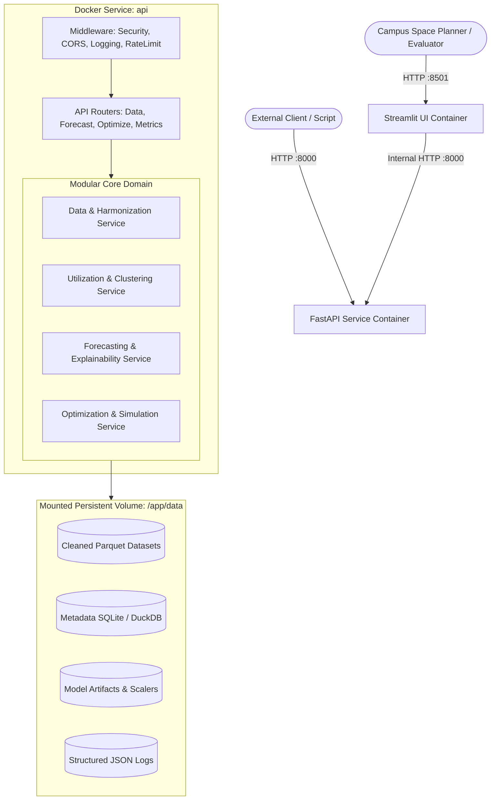
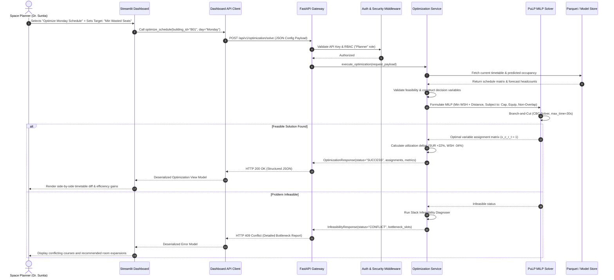
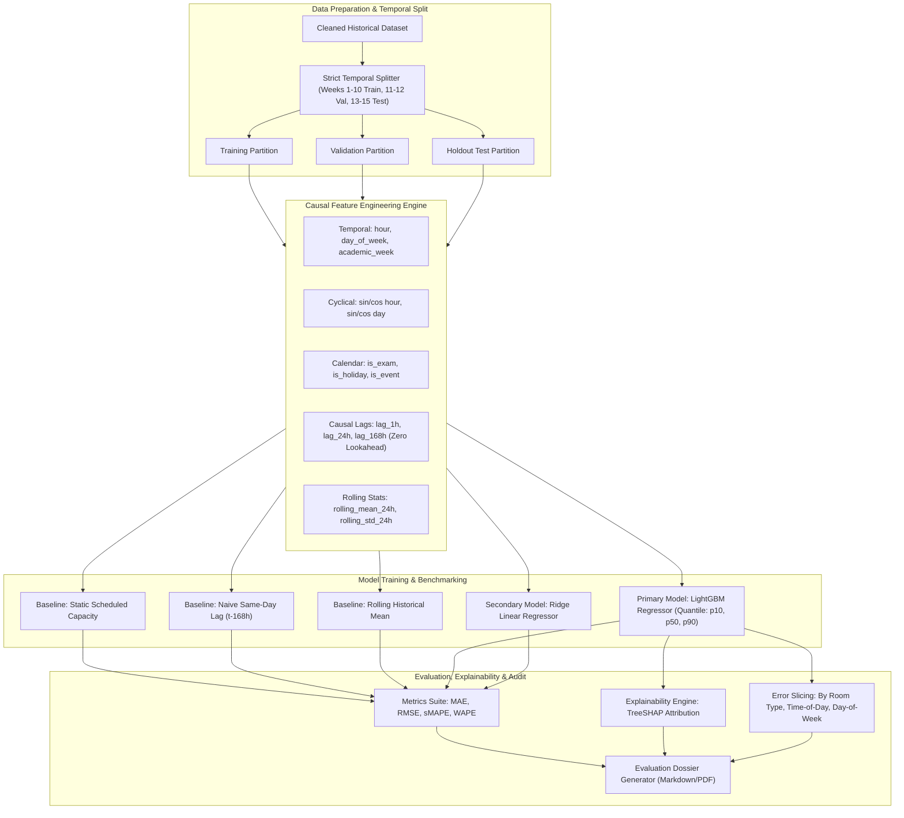
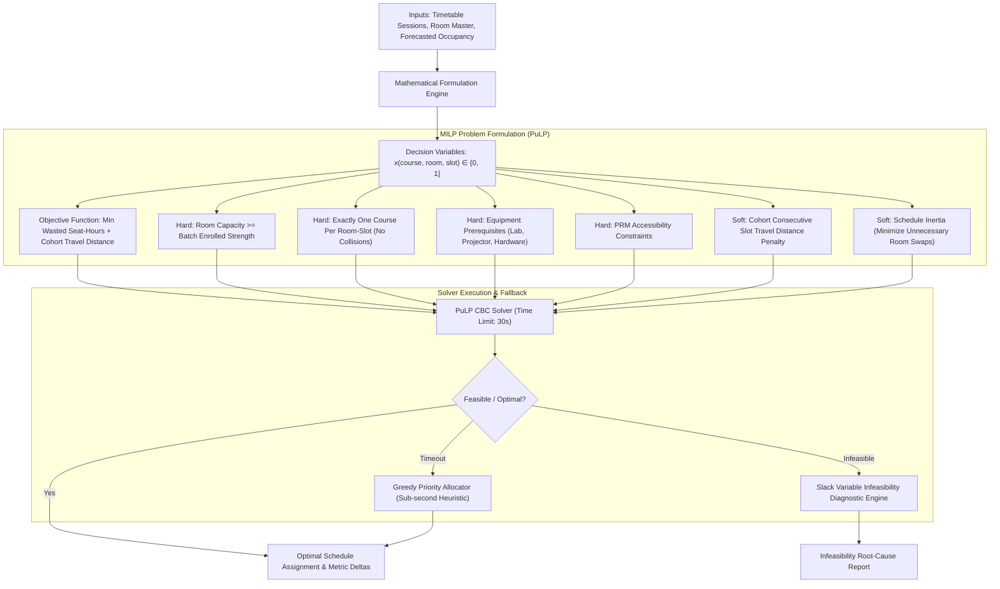
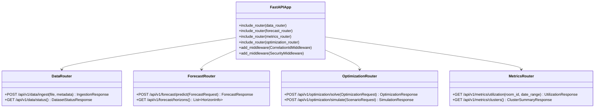
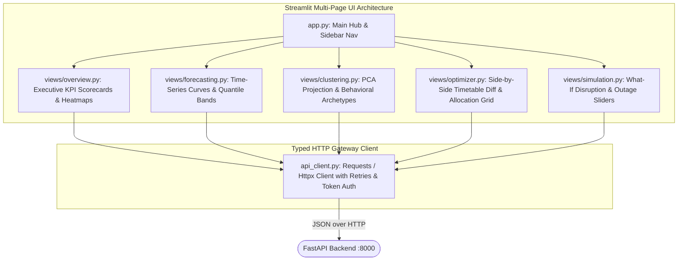
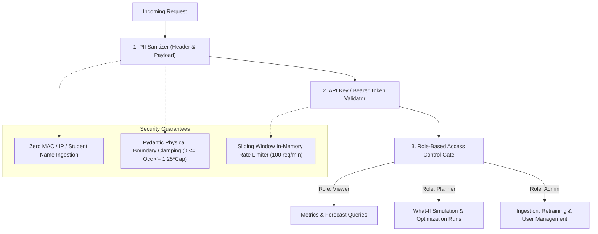
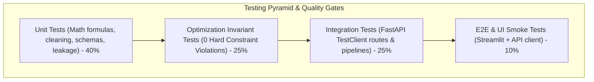
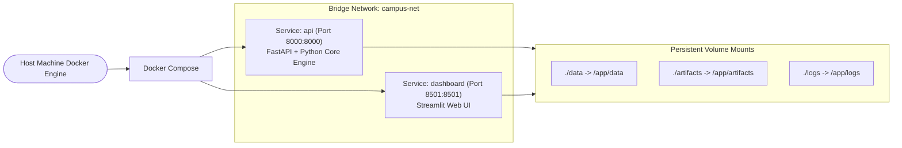

# BDS-06: Campus Occupancy Forecasting with Spatiotemporal Analytics and Capacity Optimization
## Technical Architecture & System Design Document
**Academic Context:** T.Y. B.Sc. Data Science – Semester V Capstone Project  
**Document Reference:** `docs/02_architecture.md`  
**Status:** Approved for Implementation  
**Target Audience:** Engineering Team, Academic Evaluators, DevOps Operators  

> **Implementation status note (2026-10-01):** This document preserves the original architecture/design intent; several diagrams and the sample tree below are aspirational or historical and are not a literal inventory of the current repository. For the deployed scope, use the actual `app/` tree and the [final report](final_report.md): FastAPI + Streamlit, two Compose services, API-mediated Overview/Forecast Explorer, synthetic Parquet/CSV inputs, and an XGBoost one-hour point forecast. The current dashboard does not expose optimizer, simulation, clustering, or SHAP pages. Verified gaps are recorded in [the evidence matrix](bds06_evidence_matrix.md).

---

## 1. Executive Architectural Blueprint & Guiding Principles

### 1.1 Architectural Pattern: Modular Monolith
To satisfy industry-grade software engineering standards while adhering to the scope of a T.Y. B.Sc. Data Science capstone project, BDS-06 adopts a **Modular Monolith Architecture** with decoupled presentation and service boundaries. 

Distributed microservice architectures (e.g., separate services for cleaning, forecasting, optimization, and auth over gRPC/Kafka) introduce distributed state management, network serialization overhead, and deployment fragility that are inappropriate for a student industry prototype. Instead, BDS-06 packages its core domain logic into cohesive, independently testable Python modules running within a unified application runtime, backed by a containerized **FastAPI** backend and an interactive **Streamlit** dashboard.

```
+-----------------------------------------------------------------------------------------------+
|                                       SYSTEM ARCHITECTURE                                     |
+-----------------------------------------------------------------------------------------------+
|                                                                                               |
|   +---------------------------------------------------------------------------------------+   |
|   |                        PRESENTATION LAYER (Docker: dashboard)                         |   |
|   |   Streamlit Multi-Page UI: Executive KPIs | Heatmaps | Scenario Studio | SHAP View    |   |
|   +---------------------------------------------------------------------------------------+   |
|                                           | (REST / HTTP JSON)                                |
|   +---------------------------------------------------------------------------------------+   |
|   |                           API GATEWAY LAYER (Docker: api)                             |   |
|   |   FastAPI Service: Routers | Auth/RBAC | Pydantic Validation | Rate Limiter | CORS    |   |
|   +---------------------------------------------------------------------------------------+   |
|                                           | (In-Process Dependency Injection)                 |
|   +---------------------------------------------------------------------------------------+   |
|   |                             CORE DOMAIN SERVICE LAYER                                 |   |
|   |  +--------------------+  +--------------------+  +--------------------------------+   |   |
|   |  | Data & Timetable   |  | Utilization &      |  | ML Forecasting & Baselines     |   |   |
|   |  | Harmonizer Engine  |  | Room Clustering    |  | (LightGBM, Quantile, Leak-Free)|   |   |
|   |  +--------------------+  +--------------------+  +--------------------------------+   |   |
|   |  +--------------------+  +--------------------+  +--------------------------------+   |   |
|   |  | Optimization &     |  | Explainability     |  | Experiment Tracking &          |   |   |
|   |  | What-If Solver     |  | & Error Slicing    |  | Dossier Generation Engine      |   |   |
|   |  +--------------------+  +--------------------+  +--------------------------------+   |   |
|   +---------------------------------------------------------------------------------------+   |
|                                           | (Zero-Network Disk / Memory I/O)                  |
|   +---------------------------------------------------------------------------------------+   |
|   |                            PERSISTENCE & STORAGE LAYER                                |   |
|   |   Apache Parquet (Time-Series) | SQLite / DuckDB (Metadata) | Joblib (Model Registry) |   |
|   +---------------------------------------------------------------------------------------+   |
+-----------------------------------------------------------------------------------------------+
```

### 1.2 Core Architectural Principles
1. **Separation of Concerns (SoC):** Business logic, mathematical solvers, and ML models are completely decoupled from web framework controllers (FastAPI) and UI components (Streamlit). Every domain module functions as an independent, importable Python library.
2. **Zero Host Contamination:** The full lifecycle executes identically inside containerized environments (`docker compose up`) across Windows, macOS, and Linux.
3. **Determinism & Reproducibility:** Every stochastic routine (data splits, model training, heuristic optimization) is tied to immutable random seeds and declarative configuration manifests.
4. **Leakage-Free Temporal Discipline:** Feature extraction enforces strict causal ordering. No future observation informs prior predictions.
5. **Fail-Safe Invariant Enforcement:** Optimization algorithms strictly enforce zero hard constraint violations (capacity overflows, room collisions, equipment mismatches) through automated validation invariants.
6. **Privacy by Design:** Zero Personally Identifiable Information (PII) is accepted at the API boundary or persisted to disk.

---

## 2. Overall System Architecture & Deployment Topology

The operational deployment comprises two containerized services orchestrated via Docker Compose:
- **`api` Container:** Hosts the FastAPI REST application, orchestrates ML inference, runs background optimization tasks, and serves OpenAPI contracts.
- **`dashboard` Container:** Hosts the Streamlit analytical interface, communicating with the `api` service over an internal Docker network.



---

## 3. Component Responsibilities & Module Decomposition

The project codebase is partitioned into distinct namespaces under `src/`:

```
Campus-Occupancy-Forecasting/
├── docker/
│   ├── Dockerfile.api
│   ├── Dockerfile.dashboard
│   └── docker-compose.yml
├── docs/
│   ├── 01_requirements.md
│   ├── 02_architecture.md
│   ├── evaluation_dossier.md
│   └── runbook.md
├── src/
│   ├── __init__.py
│   ├── core/                  # System-wide utilities, logging, config, security
│   │   ├── config.py          # Pydantic settings & environment management
│   │   ├── logging.py         # Structured JSON logging with correlation IDs
│   │   ├── security.py        # API key authentication & PII sanitization
│   │   └── exceptions.py      # Domain-specific exception hierarchy
│   ├── schemas/               # Contract definitions & validation models
│   │   ├── timetable.py       # Pydantic models for timetable slots & schedules
│   │   ├── occupancy.py       # Sensor telemetry schemas & Pandera DataFrame models
│   │   ├── forecast.py        # Forecast request & response payload schemas
│   │   ├── optimization.py    # Optimization constraints & scenario schemas
│   │   └── metrics.py         # Utilization metrics response models
│   ├── data/                  # Ingestion, cleaning & harmonization
│   │   ├── ingestion.py       # Raw file parsers (CSV, JSON, XLSX)
│   │   ├── cleaner.py         # Outlier detection, imputation & deduplication
│   │   ├── harmonizer.py      # Timetable-to-sensor temporal synchronization
│   │   └── generator.py       # Statistically realistic synthetic campus data engine
│   ├── analytics/             # Spatial analytics & utilization metrics
│   │   ├── metrics.py         # SUR, RFU, Wasted Seat-Hours mathematical formulas
│   │   └── clustering.py      # K-Means & HDBSCAN behavioral room clustering
│   ├── models/                # Machine learning & statistical forecasting
│   │   ├── features.py        # Temporal, cyclical, and causal lag feature extractor
│   │   ├── baselines.py       # Heuristic baselines (Static, 7D Lag, Rolling Mean)
│   │   ├── forecaster.py      # LightGBM / Ridge multi-horizon quantile forecaster
│   │   ├── evaluation.py      # MAE, RMSE, sMAPE, WAPE evaluation harness
│   │   └── explainability.py  # TreeSHAP feature attribution & error slicing
│   ├── optimization/          # Operations research & scenario simulation
│   │   ├── solver.py          # PuLP Mixed-Integer Linear Program (MILP) solver
│   │   ├── heuristics.py      # Fallback fast greedy priority allocator
│   │   ├── constraints.py     # Hard & soft mathematical constraint definitions
│   │   ├── diagnostics.py     # Infeasibility analyzer & bottleneck locator
│   │   └── simulator.py       # What-If scenario perturbation engine
│   ├── api/                   # FastAPI application & HTTP controllers
│   │   ├── main.py            # App initialization, middleware & lifecycle events
│   │   ├── deps.py            # Dependency injection (services, auth)
│   │   └── routes/            # REST endpoint routers
│   │       ├── health.py      # Health checks & system status
│   │       ├── data.py        # Ingestion & cleaning triggers
│   │       ├── metrics.py     # Utilization & clustering queries
│   │       ├── forecast.py    # Real-time & batch prediction endpoints
│   │       └── optimize.py    # Optimization & simulation runs
│   └── dashboard/             # Streamlit web application
│       ├── app.py             # Main entry point & sidebar navigation
│       ├── api_client.py      # Typed HTTP client communicating with FastAPI
│       └── views/             # Page views
│           ├── overview.py    # Campus KPI cards & spatial heatmaps
│           ├── forecasting.py # Interactive time-series forecast explorer
│           ├── clustering.py  # 2D PCA cluster space & archetype profiling
│           ├── optimizer.py   # Timetable reallocator & constraint inspector
│           └── simulation.py  # What-if scenario disruption playground
├── tests/                     # Automated testing suite
│   ├── conftest.py            # Pytest fixtures & synthetic data mocks
│   ├── unit/                  # Unit tests (math, cleaning, schemas)
│   ├── integration/           # API route tests & pipeline integration
│   ├── optimization/          # Optimization invariant & solver tests
│   └── regression/            # Leakage checks & model performance regressions
├── artifacts/                 # Serialized models, scalers, and run configs
├── data/                      # Local storage partition (raw, processed, parquet)
└── logs/                      # Structured operational JSON log outputs
```

---

## 4. End-to-End Data Flow Architecture

The data lifecycle transitions across four discrete physical states: **Raw**, **Cleaned**, **Harmonized**, and **Feature Store / Inference Tiers**.

```mermaid
flowchart LR
    subgraph S1 ["1. Ingestion Tier"]
        RawCSV[("Raw Timetables (CSV/JSON)")]
        RawSens[("Sensor Logs (PIR / Wi-Fi)")]
    end

    subgraph S2 ["2. Data Harmonization Tier"]
        Parser["Ingestion Parser (Schema Validation)"]
        Cleaner["Cleaner (Deduplication, IQR Outliers, Imputation)"]
        Harmonizer["Harmonizer (15m/60m Grid Alignment)"]
        CleanParquet[("Cleaned Parquet Store")]
    end

    subgraph S3 ["3. Analytic & ML Tier"]
        MetricsEng["Utilization Metrics (SUR, RFU, WSH)"]
        ClusterEng["Room Clustering (K-Means/HDBSCAN)"]
        FeatEng["Feature Engineering (Causal Lags, Calendar)"]
        ModelTrain["Model Training & Evaluation"]
        Artifacts[("Model Registry (.joblib, configs)")]
    end

    subgraph S4 ["4. Decision Support Tier"]
        Forecaster["Inference Service (p10, p50, p90)"]
        MILP["MILP Optimizer / Simulator"]
        FastAPI["FastAPI Endpoints"]
        Dashboard["Streamlit UI Dashboard"]
    end

    RawCSV --> Parser
    RawSens --> Parser
    Parser --> Cleaner
    Cleaner --> Harmonizer
    Harmonizer --> CleanParquet

    CleanParquet --> MetricsEng
    CleanParquet --> ClusterEng
    CleanParquet --> FeatEng
    FeatEng --> ModelTrain
    ModelTrain --> Artifacts

    CleanParquet --> Forecaster
    Artifacts --> Forecaster
    Forecaster --> MILP
    MetricsEng --> FastAPI
    ClusterEng --> FastAPI
    Forecaster --> FastAPI
    MILP --> FastAPI
    FastAPI --> Dashboard
```



### 4.1 Ingestion & Sanitization State
- Raw files arrive via `POST /api/v1/data/ingest`.
- Data is parsed through strict Pydantic schemas. Non-compliant records are rejected with descriptive HTTP 422 payloads.
- IP addresses, device MAC IDs, and student roll numbers are stripped before disk write.

### 4.2 Harmonization State
- Sensor counts are binned into uniform 15-minute and 60-minute windows.
- Timetable course entries are mapped to discrete `(room_id, date, time_slot)` indices.
- Telemetry and schedules are joined into a unified spatio-temporal dataframe and saved as columnar **Apache Parquet** files for high-throughput reads.

---

## 5. Sequence Flow for a Typical User Request

### 5.1 End-to-End Flow: Capacity Optimization Run
The following sequence details how an end-user triggers a constraint-aware capacity optimization run from the Streamlit UI through the backend services to persistent storage.



---

## 6. Machine Learning (ML) Pipeline Architecture



### 6.1 Data Leakage Prevention Engine
1. **Temporal Boundaries:** Dataset splitting strictly obeys the time arrow:
   $$\max(\text{Train Timestamps}) < \min(\text{Validation Timestamps}) < \min(\text{Test Timestamps})$$
2. **Transformer Isolation:** All feature transformers (e.g., standard scalers, target encoders) are fitted strictly on the training partition and evaluated out-of-sample.
3. **Causal Lag Computation:** Lag features $y_{t - k}$ require $k \ge \text{Forecast Horizon } H$. For a 24-hour ahead forecast, no feature uses lags smaller than 24 hours.

### 6.2 Uncertainty Quantification
The primary LightGBM forecasting engine trains three independent objective loss functions to deliver prediction intervals:
- **p10 (Lower Bound):** Pinball Loss with $\alpha = 0.10$.
- **p50 (Median Expectation):** L1 Objective (MAE minimization) with $\alpha = 0.50$.
- **p90 (Upper Bound):** Pinball Loss with $\alpha = 0.90$.

---

## 7. Optimization Pipeline Architecture

The capacity optimization engine automates room-to-course scheduling to minimize energy waste and travel overhead while strictly adhering to physical and pedagogical constraints.



### 7.1 Mathematical Formulation
Let:
- $\mathcal{C}$ be the set of course lecture sessions.
- $\mathcal{R}$ be the set of candidate rooms.
- $\mathcal{T}$ be the set of operational academic time slots.
- $x_{c, r, t} \in \{0, 1\}$ be the binary decision variable indicating course $c$ is assigned to room $r$ at slot $t$.

#### Objective Function:
$$\min \sum_{c \in \mathcal{C}} \sum_{r \in \mathcal{R}} \sum_{t \in \mathcal{T}} x_{c,r,t} \left[ \left(\text{Cap}_r - \hat{y}_{c,t}\right) + \lambda_1 \cdot \text{Dist}(r, \text{PrevRoom}_c) + \lambda_2 \cdot (1 - \delta_{r, r_{\text{orig}}}) \right]$$
Where:
- $\text{Cap}_r - \hat{y}_{c,t}$ is the empirical wasted seats (room capacity minus predicted course attendance).
- $\text{Dist}(r, \text{PrevRoom}_c)$ penalizes inter-building travel for the student cohort between consecutive slots.
- $1 - \delta_{r, r_{\text{orig}}}$ penalizes deviation from the original baseline room (schedule inertia).
- $\lambda_1, \lambda_2$ are scalar weighting parameters.

#### Hard Constraints:
1. **Capacity Guarantee:** $\forall c, r, t: x_{c,r,t} \cdot \text{Enroll}_c \le \text{Cap}_r$
2. **Single Occupancy:** $\forall r, t: \sum_{c \in \mathcal{C}} x_{c,r,t} \le 1$
3. **Mandatory Scheduling:** $\forall c \in \mathcal{C}: \sum_{r \in \mathcal{R}} \sum_{t \in \mathcal{T}_c} x_{c,r,t} = 1$
4. **Equipment Compatibility:** $x_{c,r,t} \cdot \text{ReqEquipment}_c \le \text{HasEquipment}_r$

---

## 8. API Boundary & Interface Contracts

The FastAPI application encapsulates the domain models behind a RESTful boundary.



### 8.1 Core API Contracts (Pydantic Models)

#### `ForecastRequest`
```json
{
  "room_ids": ["R101", "R102"],
  "start_timestamp": "2026-09-24T08:00:00Z",
  "horizon_hours": 24,
  "include_quantiles": true
}
```

#### `ForecastResponse`
```json
{
  "status": "SUCCESS",
  "model_version": "v1.2.0-lgbm",
  "generated_at": "2026-09-23T20:20:00Z",
  "predictions": [
    {
      "room_id": "R101",
      "timestamp": "2026-09-24T08:00:00Z",
      "predicted_occupancy_p50": 42.5,
      "predicted_occupancy_p10": 36.1,
      "predicted_occupancy_p90": 47.8,
      "scheduled_capacity": 60,
      "expected_wasted_seats": 17.5
    }
  ]
}
```

#### `OptimizationRequest`
```json
{
  "academic_term": "TERM-V",
  "target_date": "2026-09-28",
  "solver_timeout_seconds": 30.0,
  "weights": {
    "wasted_seat_weight": 1.0,
    "travel_distance_weight": 0.3,
    "inertia_weight": 0.1
  }
}
```

---

## 9. Dashboard Boundary & Visualization Architecture

The user interface is an interactive multi-page **Streamlit** application structured into analytical workflows. It never interacts with storage or ML models directly; all interactions traverse the typed `APIClient`.



---

## 10. Storage & Persistence Layer Architecture

Rather than burdening a capstone demonstration with complex relational database management engines (PostgreSQL/Oracle) or distributed clusters, BDS-06 leverages a zero-maintenance, zero-overhead storage stack:

```
data/
├── raw/                      # Immutable incoming uploads (CSV/JSON)
├── processed/                # Cleaned, standardized Parquet files
│   ├── timetable.parquet     # Master academic schedules
│   ├── occupancy.parquet     # 15m/60m harmonized sensor counts
│   └── rooms_master.parquet  # Physical room capacities, equipment & zones
├── metadata.db               # SQLite database for audit logs, scenario jobs, and users
└── artifacts/                # Serialized models, scalers, and run configs
    ├── forecaster_lgbm.joblib
    ├── scaler_features.joblib
    ├── cluster_kmeans.joblib
    └── experiment_runs.json
```

- **Apache Parquet:** Stores high-cardinality time series. Features columnar compression (Snappy), fast column pruning, and direct interoperability with DuckDB, Pandas, and PyArrow.
- **SQLite (`metadata.db`):** Stores low-cardinality operational states: API keys, scenario job execution history, ingestion audit records, and user session metadata.
- **Artifact Store (`artifacts/`):** Immutable serialized model binaries, feature names, hyperparameter configurations, and evaluation reports.

---

## 11. Logging, Monitoring & Operational Telemetry

BDS-06 incorporates structured operational logging and latency tracking across every layer.


### 11.1 Structured Log Entry Format
```json
{
  "timestamp": "2026-09-23T20:25:01.124Z",
  "level": "INFO",
  "correlation_id": "a9f8b2c1-d4e5-4f3a-8b1e-6c7d8e9f0a1b",
  "service": "api.optimization",
  "endpoint": "/api/v1/optimization/solve",
  "method": "POST",
  "status_code": 200,
  "duration_ms": 1420.5,
  "payload_summary": {
    "num_courses": 48,
    "num_rooms": 22,
    "solver_status": "OPTIMAL",
    "wsh_reduction_pct": 24.8
  }
}
```

---

## 12. Security Boundary & Privacy Controls



- **Zero-PII Assurance:** Ingestion routines explicitly reject fields named `student_id`, `roll_no`, `mac_address`, `ip`, or `name`. Sensor streams strictly accept numerical counts and room identifiers.
- **RBAC Roles:**
  - `Viewer`: Read-only access to dashboard and forecast endpoints.
  - `Planner`: Authorized to run optimization and what-if simulation scenarios.
  - `Admin`: Full access including raw data ingestion and pipeline re-training triggers.

---

## 13. Testing & Quality Assurance Architecture

The codebase enforces a rigorous test pyramid implemented via `pytest`:



### Key Test Assertions:
1. **Optimization Invariants (`test_optimizer.py`):**
   - $\sum x_{c,r,t} \le 1$ (Zero room collisions).
   - $\text{Enroll}_c \le \text{Cap}_r$ for all assigned rooms.
   - Equipment flags match $100\%$ of prerequisites.
2. **Temporal Leakage Invariants (`test_leakage.py`):**
   - Asserts that for all engineered lag features $L_k$, the temporal lag $k \ge 1$.
   - Verifies train split timestamps strictly precede validation/test timestamps.
3. **Metric Mathematical Correctness (`test_metrics.py`):**
   - Validates SUR, RFU, and WSH against synthetic hand-calculated matrices.

---

## 14. Containerized Deployment & Execution Topology

The platform provides a turnkey deployment through `docker-compose.yml`:



### Turnkey Execution:
```bash
# 1-Click Startup
docker compose -f docker/docker-compose.yml up --build

# Access Interfaces:
# Streamlit Dashboard:  http://localhost:8501
# FastAPI Swagger Docs: http://localhost:8000/docs
# Healthcheck Endpoint: http://localhost:8000/api/v1/health
```

---

## 15. Architectural Traceability Matrix

| Requirement Domain | Target Module (`src/`) | Verification Suite |
| :--- | :--- | :--- |
| **Ingestion & Validation** | `src/schemas/`, `src/data/ingestion.py` | `tests/unit/test_schemas.py`, `test_ingestion.py` |
| **Data Cleaning & Harmonization** | `src/data/cleaner.py`, `src/data/harmonizer.py` | `tests/unit/test_cleaner.py` |
| **Utilization Metrics & Clustering** | `src/analytics/metrics.py`, `clustering.py` | `tests/unit/test_metrics.py`, `test_clustering.py` |
| **Temporal Forecasting & Baselines**| `src/models/forecaster.py`, `baselines.py` | `tests/unit/test_forecaster.py`, `test_baselines.py` |
| **Leakage & Explainability** | `src/models/features.py`, `explainability.py`| `tests/regression/test_leakage.py`, `test_explain.py` |
| **Optimization & Simulation** | `src/optimization/solver.py`, `simulator.py` | `tests/optimization/test_optimizer.py` |
| **API Boundary & Auth** | `src/api/` | `tests/integration/test_api.py` |
| **Dashboard** | `src/dashboard/` | Smoke tests via `TestClient` and UI fixtures |
| **Containerization** | `docker/` | Docker Compose build & healthcheck verification |
