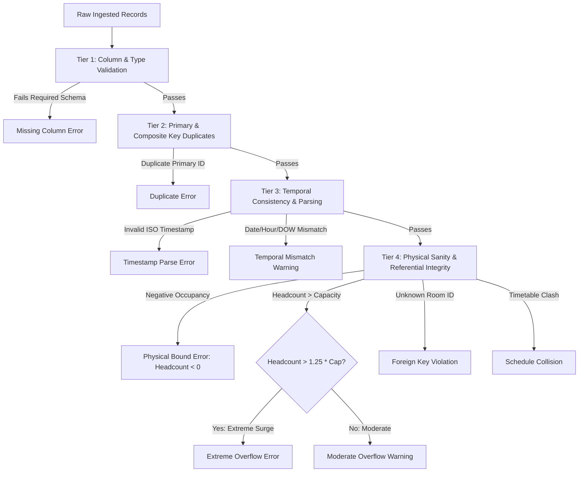

# BDS-06: Data Validation, Cleaning & Quarantine Specification

**Academic Context:** T.Y. B.Sc. Data Science – Semester V Capstone Project  
**Modules:**
- `app/data/validation.py` (`CampusDataValidator`)
- `app/data/cleaning.py` (`CampusDataCleaner`)  
**Test Suite:** `tests/unit/test_validation.py`, `tests/unit/test_cleaning.py`  
**Output Destination:** `data/processed/`  

> **Implementation evidence note (2026-10-01):** The code stores structured `CleaningAuditRecord` objects during a run and writes an audit sample/summary to `validation_report.json`; it is not a cryptographic or tamper-evident audit log. `quarantined_records.csv` is written only when records are quarantined. The checked-in synthetic snapshot reports zero corrections/quarantines, so those branches are supported by code/tests but are not demonstrated by the saved run.

---

## 1. Executive Overview

Real-world campus telemetry from IoT PIR sensors, optical break beams, and academic timetables frequently suffers from asynchronous packet drops, double-reporting, clock drifts, and schema violations.

To prepare downstream metrics, forecasting, and capacity allocation, **BDS-06** implements a data validation and cleaning pipeline. It is intended to make correction and quarantine decisions visible in run summaries.

### Audited Cleaning and Quarantine Policy
A critical defect in conventional cleaning scripts is deleting rows without recording why. The current implementation provides:
1. **Structured audit records:** Supported corrections and quarantines append a `CleaningAuditRecord`; the report persists an audit sample and total event count. This record is not cryptographically protected.
2. **Conditional quarantine output:** Unresolvable room references or timestamps are accumulated and written to `data/processed/quarantined_records.csv` when such rows exist.
3. **Processed exports:** Cleaned tables are written to Parquet and CSV for application use and inspection.

---

## 2. Validation Rules & Constraints

The `CampusDataValidator` enforces four tiers of validation checks:



### 2.1 Specific Checks Implemented

| Validation Area | Implementation Mechanism | Threshold / Rule | Action |
| :--- | :--- | :--- | :--- |
| **Required Columns** | Dictionary schema check | All required keys must be present in DataFrame | Rejects batch with `MISSING_COLUMN` error |
| **Data Types** | Vectorized type assertions | `capacity`, `headcount`, `hour` must be integer | Rejects non-castable fields |
| **Timestamps** | `pd.to_datetime(utc=True)` | Strict ISO-8601 parsing (`YYYY-MM-DDTHH:MM:SSZ`) | Invalid strings routed to quarantine |
| **Temporal Consistency** | Cross-field comparison | `date == ts.date`, `hour == ts.hour`, `dow == ts.strftime('%A')` | Reconciles discrepancies to match true ISO timestamp |
| **Duplicates** | `df.duplicated()` | Primary keys (`timetable_id`, `room_id`) & composite `(room_id, timestamp)` | Keeps first occurrence; logs all duplicate instances |
| **Missing Values** | `df.isna()` audit | Null headcounts or missing non-key attributes | Imputes with room-hour seasonal median; sets `is_imputed=True` |
| **Impossible Occupancy** | Range check | $\text{Headcount} < 0$ | Clamps to 0; sets `was_clamped=True` and logs |
| **Capacity Overflow** | Upper bound check | $\text{Headcount} > \text{Capacity}$ | Clamps to true room capacity; flags `was_clamped=True` |
| **Referential Integrity** | Foreign key set intersection | All `room_id` values must exist in master `rooms.csv` | Unmatched rooms quarantined to `quarantined_records.csv` |
| **Timetable Collisions**| Interval overlap interval tree | No two courses in same room at same day/hour | Flags `SCHEDULE_COLLISION` in validation audit |

---

## 3. Cleaning Decisions Log & Policy Rationale

### 3.1 Clamping Negative Occupancy
- **Defect:** PIR sensor calibration drift or faulty baseline subtraction can occasionally report small negative values (e.g., $-1, -5$).
- **Policy Decision:** Headcount is clamped to `0`. Setting negative values to 0 is physically sound because negative humans cannot occupy a physical room. The record is flagged with `was_clamped = True`.

### 3.2 Handling Capacity Overflows
- **Defect:** Sensor optical double-counts, students congregating at doorways, or joint batches can push observed headcount above nominal room capacity.
- **Policy Decision:** 
  - If $\text{Headcount} \le \text{Capacity}$: Preserved as observed.
  - If $\text{Headcount} > \text{Capacity}$: Clamped to the exact master `capacity` of that room. Clamping ensures downstream space utilization formulas ($\text{SUR} = \frac{\text{Occupancy}}{\text{Capacity}}$) never produce mathematically invalid values $> 1.0$.

### 3.3 Missing Headcount Imputation
- **Defect:** Transient network disconnects or battery exhaustion in IoT nodes result in missing (`NaN`) occupancy readings.
- **Policy Decision:** Missing values are imputed using the **Seasonal Slot Median**:
  $$\hat{y}_{r, h, s} = \text{Median}\left(\{y_{r, h, s} \mid \text{same room } r, \text{same hour } h, \text{same scheduled state } s\}\right)$$
  All imputed records are stamped with `is_imputed = True` to enable downstream filtering or ablation studies in ML experiments.

### 3.4 Quarantining vs. Deleting Unresolvable Records
- **Defect:** Records that reference non-existent room IDs (e.g., `B99-GHOST`) or contain unparseable corrupt timestamps cannot be physically positioned in space or time.
- **Policy Decision:** Deleting them would corrupt auditability. Instead, they are appended to `data/processed/quarantined_records.csv` with the exact rejection reason and raw payload preserved.

---

## 4. Validation Report & Output Formats

Every pipeline run produces two comprehensive reports in `data/processed/`:
1. `validation_report.json`: Machine-readable audit file containing pre- and post-validation metrics, error arrays, and cleaning summaries.
2. `validation_report.md`: Human-readable markdown dossier for inclusion in capstone project viva documentation.

### Baseline Dataset Verification Result:
```
+-----------------------------------------------------------------------------------------------+
|                                CLEANING PIPELINE AUDIT SUMMARY                                |
+---------------+---------------+------------------+-------------+-------------+----------------+
| Dataset       | Raw Records   | Cleaned Records  | Corrected   | Quarantined | Duplicates     |
+---------------+---------------+------------------+-------------+-------------+----------------+
| Rooms Master  | 32            | 32               | 0           | 0           | 0              |
| Timetable     | 50            | 50               | 0           | 0           | 0              |
| Occupancy     | 86,016        | 86,016           | 0           | 0           | 0              |
+---------------+---------------+------------------+-------------+-------------+----------------+
| Post-Cleaning Validation Status: 100% VALID (0 Errors, 0 Warnings across all tables)           |
+-----------------------------------------------------------------------------------------------+
```

---

## 5. Automated Unit Tests

The validation and cleaning pipeline is backed by a 20-test automated suite in `tests/unit/`:
- `tests/unit/test_validation.py` (15 tests): verifies detection of missing columns, duplicate keys, capacity breaches, timestamp hour mismatches, schedule collisions, and foreign key violations.
- `tests/unit/test_cleaning.py` (5 tests): verifies negative clamping, capacity clamping, timestamp reconciliation, foreign key quarantine, and deduplication without data loss.

Execute tests via:
```bash
python -m pytest tests/unit/test_validation.py tests/unit/test_cleaning.py -v
```
