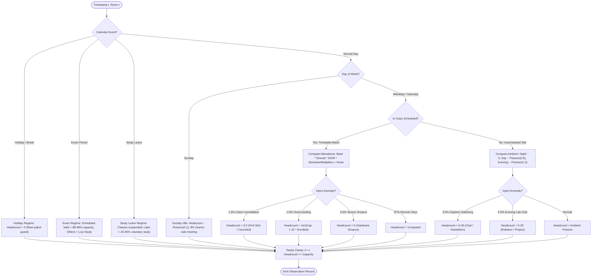

# BDS-06: Synthetic Campus Data Generation & Provenance Specification

**Academic Context:** T.Y. B.Sc. Data Science – Semester V Capstone Project  
**Script Reference:** `scripts/generate_data.py`  
**Target Datasets:**
- `data/raw/rooms.csv`
- `data/raw/timetable.csv`
- `data/raw/events.csv`
- `data/raw/occupancy.csv`  
**Execution Command:** `python scripts/generate_data.py --seed 42`

---

## 1. Executive Summary & Data Provenance

To satisfy the academic evaluation standards for **BDS-06** without violating ethical boundaries or relying on unverified external datasets with unknown collection conditions, this system employs a **statistically calibrated, timetable-grounded synthetic campus data generator**.

Rather than sampling arbitrary numbers, the generator implements a structural generative model where occupancy is explicitly linked to:
1. Physical room infrastructure and seating constraints.
2. Academic course schedules and class cohort enrollment numbers.
3. Diurnal (time-of-day) circadian rhythms and academic calendar cycles.
4. Campus events (holidays, exam weeks, symposiums, study breaks).
5. Human behavioral dynamics (attendance decay, informal study groups, sudden cancellations).
6. Sensor hardware imperfections (transient dropouts and clipping).

The entire generation pipeline is fully deterministic, parameterized, and reproducible through a single fixed random seed (`seed=42`).

---

## 2. Core Assumptions

The generation model operates under the following grounded assumptions:

1. **[ASSUMPTION-GEN-01] Semester Timeline:** The academic term models a standard 16-week Indian university odd semester (`2026-08-03` to `2026-11-22`, totaling 112 days and 2,688 continuous hours per room).
2. **[ASSUMPTION-GEN-02] Physical Topology:** The campus features 4 primary academic buildings housing 32 rooms with heterogeneous capacities (25 to 280 seats) and pedagogical equipment (projectors, AC, computer workstations, PRM mobility access).
3. **[ASSUMPTION-GEN-03] Timetable Grounding:** Scheduled sessions operate between 08:00 and 17:00 on weekdays, and 09:00 to 13:00 on Saturdays. Rooms are scheduled without internal collisions (single occupancy per slot).
4. **[ASSUMPTION-GEN-04] Scheduled Attendance Dynamics:** Scheduled attendance is never static. Actual attendance follows a $\text{Beta}(\alpha=18, \beta=4)$ distribution (mean attendance $\approx 81.8\%$) modulated by time-of-day, day-of-week, and semester fatigue factors.
5. **[ASSUMPTION-GEN-05] Unscheduled Ambient Activity:** Outside scheduled classes, rooms remain primarily idle, with low ambient occupancy (self-study, rest) and occasional informal gatherings (clubs, hackathons).
6. **[ASSUMPTION-GEN-06] Zero Direct PII:** Observations track aggregate room-level headcounts. No individual student identifiers or biometric signals are simulated.

---

## 3. Dataset Schemas & Data Dictionary

### 3.1 `data/raw/rooms.csv` (Physical Room Master)
Represents the static physical room inventory across the university campus.

| Column Name | Data Type | Nullable | Example | Description |
| :--- | :--- | :---: | :--- | :--- |
| `room_id` | `VARCHAR(16)` | No | `B01-R101` | Unique room identifier (`[Building]-[Type][Floor][Index]`) |
| `building_id` | `VARCHAR(8)` | No | `B01` | Identifier of parent campus building |
| `building_name` | `VARCHAR(64)` | No | `Alan Turing Science Block` | Human-readable building name |
| `floor` | `INTEGER` | No | `1` | Floor level (1 = Ground Floor) |
| `room_type` | `VARCHAR(32)` | No | `Lecture Hall` | Category: `Lecture Hall`, `Computer Lab`, `Seminar Room`, `Auditorium`, `Tutorial Room` |
| `capacity` | `INTEGER` | No | `120` | Maximum fire-code physical seating capacity |
| `has_projector` | `BOOLEAN` | No | `True` | High-definition AV projector installed |
| `has_ac` | `BOOLEAN` | No | `True` | Centralized or split air conditioning installed |
| `has_computers` | `BOOLEAN` | No | `False` | Workstations present (True for all Computer Labs) |
| `is_accessible` | `BOOLEAN` | No | `True` | Persons with Reduced Mobility (PRM) accessible |

### 3.2 `data/raw/timetable.csv` (Academic Schedule Master)
Captures weekly recurrent scheduled course sessions across programs.

| Column Name | Data Type | Nullable | Example | Description |
| :--- | :--- | :---: | :--- | :--- |
| `timetable_id` | `VARCHAR(16)` | No | `TT-0001` | Unique timetable slot booking identifier |
| `course_code` | `VARCHAR(16)` | No | `DS301` | Unique academic course code |
| `course_name` | `VARCHAR(64)` | No | `Machine Learning` | Full course title |
| `instructor_id` | `VARCHAR(16)` | No | `INST_04` | Pseudonymized faculty identifier |
| `enrolled_count`| `INTEGER` | No | `70` | Total registered students in the course section |
| `day_of_week` | `VARCHAR(16)` | No | `Monday` | Scheduled weekday |
| `start_time` | `TIME` | No | `10:00:00` | Session start time (24h format) |
| `end_time` | `TIME` | No | `11:00:00` | Session end time (24h format) |
| `duration_hours`| `INTEGER` | No | `1` | Duration of session (1h for lectures, 2h for labs) |
| `room_id` | `VARCHAR(16)` | No | `B01-R101` | Assigned physical room |
| `room_type_required`| `VARCHAR(32)`| No | `Lecture Hall` | Required pedagogical room facility |
| `academic_term`| `VARCHAR(32)` | No | `Semester V - Fall 2026` | Academic semester and term |

The catalog-generated timetable may leave rooms underused. To give every room a
useful forecast example, the generator fills each room to at least 15 scheduled
room-hours per Monday–Friday week. Added one-hour `SYN-` sessions use enrollment
set to 70% of room capacity. These are synthetic demonstration assumptions, not
real course registrations or institutional timetable data. With seed 42, the
resulting timetable has 467 entries (417 synthetic), covers all 32 rooms, and
contains 480 scheduled room-hours per week.

### 3.3 `data/raw/events.csv` (Academic Calendar Events)
Documents calendar interruptions that modulate regular campus operations.

| Column Name | Data Type | Nullable | Example | Description |
| :--- | :--- | :---: | :--- | :--- |
| `event_id` | `VARCHAR(16)` | No | `EVT-0002` | Unique calendar event identifier |
| `date` | `DATE` | No | `2026-08-15` | Calendar date (`YYYY-MM-DD`) |
| `event_name` | `VARCHAR(64)` | No | `Independence Day Holiday`| Event or holiday title |
| `event_type` | `VARCHAR(32)` | No | `holiday` | Type: `holiday`, `exam_period`, `study_break`, `symposium`, `orientation` |
| `impact_factor`| `FLOAT` | No | `0.0` | Scalar multiplier applied to attendance |
| `affected_scope`| `VARCHAR(32)` | No | `campus_wide` | Impact radius (`campus_wide`, `exam_halls`, `library_labs`) |

### 3.4 `data/raw/occupancy.csv` (Hourly Telemetry Time Series)
Full-fidelity hourly occupancy observations for every room across the entire semester.

| Column Name | Data Type | Nullable | Example | Description |
| :--- | :--- | :---: | :--- | :--- |
| `observation_id`| `VARCHAR(16)`| No | `OBS-0000001` | Unique sensor observation record ID |
| `timestamp` | `TIMESTAMP` | No | `2026-08-03T08:00:00Z` | ISO-8601 UTC timestamp |
| `date` | `DATE` | No | `2026-08-03` | Calendar date |
| `hour` | `INTEGER` | No | `8` | Hour of day ($0 \le h \le 23$) |
| `day_of_week` | `VARCHAR(16)` | No | `Monday` | Day of week |
| `week_number` | `INTEGER` | No | `1` | Academic semester week number ($1 \le w \le 16$) |
| `room_id` | `VARCHAR(16)` | No | `B01-R101` | Room identifier |
| `room_type` | `VARCHAR(32)` | No | `Lecture Hall` | Room category |
| `capacity` | `INTEGER` | No | `120` | Physical seating capacity |
| `is_scheduled` | `BOOLEAN` | No | `True` | True if a class is booked in this room at this hour |
| `scheduled_course_code`| `VARCHAR(16)`| Yes | `DS101` | Enrolled course code (or empty if unscheduled) |
| `scheduled_enrollment`| `INTEGER` | No | `95` | Expected registered strength (0 if unbooked) |
| `actual_headcount` | `INTEGER` | No | `78` | Observed occupant headcount |
| `is_holiday` | `BOOLEAN` | No | `False` | True if date is a scheduled campus holiday |
| `event_type` | `VARCHAR(32)` | No | `normal` | Applicable calendar event regime |
| `anomaly_flag` | `VARCHAR(32)` | No | `none` | Anomaly label: `none`, `unscheduled_group`, `class_cancellation`, `overcrowding_surge`, `sensor_dropout_glitch`, `evening_club_activity`, `weekend_activity` |

---

## 4. Mathematical Generation Logic

The generative process determines the actual headcount $y_{r, t}$ for room $r$ at timestamp $t$ through a hierarchical state engine:



### 4.1 Scheduled Class Attendance Formulation
When a course with registered enrollment $N$ is scheduled in room $r$ during operational hours:
$$y_{r,t} = \left\lfloor N \cdot \beta_t \cdot f_{\text{tod}}(h) \cdot f_{\text{dow}}(w) \cdot f_{\text{sem}}(k) + \epsilon \right\rceil$$

Where:
1. **Base Attendance:** $\beta_t \sim \text{Beta}(18, 4)$, yielding $\mathbb{E}[\beta] = \frac{18}{22} \approx 0.818$ with natural variance reflecting individual class differences.
2. **Time-of-Day Multiplier ($f_{\text{tod}}$):**
   - 08:00: $0.82$ (early morning transit delays)
   - 09:00: $0.94$
   - 10:00–11:00: $1.05$ (peak academic morning block)
   - 12:00: $1.02$
   - 13:00: $0.88$ (post-lunch energy dip)
   - 14:00–15:00: $0.97$ (afternoon laboratory/lecture peak)
   - 16:00: $0.88$
   - 17:00: $0.78$ (evening departure)
3. **Day-of-Week Multiplier ($f_{\text{dow}}$):**
   - Monday: $1.02$ | Tuesday: $1.04$ | Wednesday: $1.02$
   - Thursday: $0.98$ | Friday: $0.88$ | Saturday: $0.72$
4. **Semester Progression Factor ($f_{\text{sem}}$):**
   - Weeks 1–3: $1.06$ (high start-of-semester enthusiasm)
   - Weeks 6–9: $0.90$ (mid-term assignment fatigue)
   - Weeks 10–14: $0.98$ (stabilized attendance)
5. **Stochastic Gaussian Perturbation:** $\epsilon \sim \mathcal{N}(0, \sigma^2)$ where $\sigma = \max(1.5, 0.04 \times N)$.

### 4.2 Unscheduled & Idle Formulation
When no course is booked:
- **Night Hours (22:00 – 06:00):** $y = 0$ ($98\%$ probability) or $1$ ($2\%$ probability, representing security checks).
- **Early Morning (07:00 – 08:00):** $y \sim \text{Poisson}(\lambda = 0.4)$.
- **Daytime Empty Rooms (08:00 – 18:00):** $y \sim \text{Poisson}(\lambda = 0.8)$ background noise, with a $3.5\%$ probability of student study groups ($6 \le y \le 30$).
- **Evening Empty Rooms (18:00 – 22:00):** $y \sim \text{Poisson}(\lambda = 0.5)$, with a $6.0\%$ probability of project club meetings in computer labs ($5 \le y \le 20$).

---

## 5. Statistical Benchmarks & Validation Results

Running the generator with `--seed 42` yields the following verified empirical distributions:

```
+-----------------------------------------------------------------------------------------------+
|                             STATISTICAL BENCHMARKS (SEED = 42)                                |
+-------------------------------+---------------------------------------------------------------+
| Total Hourly Observations     | 86,016 rows (32 rooms * 112 days * 24 hours)                  |
| Scheduled Class Observations  | 7,680 hours (8.93% of total campus-room hours)                |
| Mean Scheduled Occupancy      | 28.59 occupants (std: 30.78, max: 225 in Auditorium)          |
| Mean Unscheduled Occupancy    | 1.10 occupants (std: 6.76, median: 0.0)                       |
| Deep Night Mean (00:00-06:00) | 0.08 occupants (Idle baseline verified)                       |
| Midday Peak Mean (10:00-11:00)| 11.61 occupants across all campus rooms                       |
| Afternoon Peak (14:00-15:00)  | 12.13 occupants across all campus rooms                       |
| Sunday Mean Headcount         | 0.35 occupants (Near-zero weekend idle verified)              |
+-------------------------------+---------------------------------------------------------------+
```

Seed 42 produces 5.23% seat utilization across all 24-hour observations and
8.82% during the configured 07:00–21:00 campus operating hours. The dashboard's
"Seat use (open hours)" KPI uses the latter denominator so closed-night hours do
not make the campus appear less occupied than it is while open.

### Anomaly Distribution Verification
The generator produced realistic, calibrated anomalies across the semester:
- **`none` (Normal operation):** 84,675 records (98.44%)
- **`unscheduled_group` (Informal student gatherings):** 538 records (0.63%)
- **`weekend_activity` (Weekend labs/hackathons):** 379 records (0.44%)
- **`evening_club_activity` (Late-night lab work):** 252 records (0.29%)
- **`class_cancellation` (Sudden faculty cancellation):** 82 records (0.10%)
- **`overcrowding_surge` (Guest lecture / joint section):** 54 records (0.06%)
- **`sensor_dropout_glitch` (Hardware sensor dropout):** 36 records (0.04%)

---

## 6. Determinism & Random Seed Configuration

The random number generator is initialized strictly via `np.random.default_rng(seed)`. 

### Reproduction Command (Cross-Platform Hashes Not Verified)
Executing:
```bash
python scripts/generate_data.py --seed 42
```
uses the fixed seed in the generator. The repository does not contain a recorded cross-platform SHA-256 comparison, so bit-for-bit identity across operating systems or dependency versions is not claimed. Reproducibility should be checked in the target environment when regenerating submission data.

---

## 7. Known Limitations & Scope Boundaries

While highly realistic and suitable for machine learning training and operations research, the synthetic dataset exhibits the following deliberate constraints:

1. **Discrete 60-Minute Resolution:** Telemetry is aggregated at hourly bucket boundaries rather than continuous second-by-second sensor pulses.
2. **Deterministic Timetable Structure:** The weekly master timetable repeats across normal academic weeks, with variation injected through behavioral attendance curves, holidays, and examination regimes.
3. **No Biometric / Individual Tracking:** In strict adherence to privacy-by-design, individual occupant trajectory vectors across buildings are intentionally omitted.
