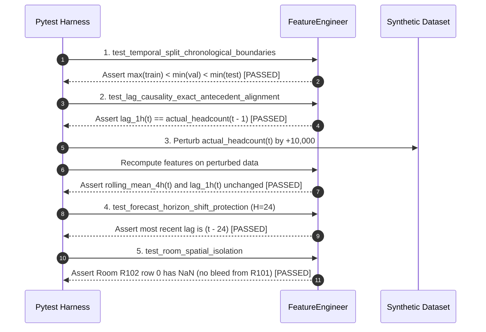

# BDS-06: Causal Feature Engineering & Spatiotemporal Representation Specification

**Academic Context:** T.Y. B.Sc. Data Science – Semester V Capstone Project  
**Module Reference:** `app/features/engineering.py` (`FeatureEngineer`)  
**Automated Verification Suite:** `tests/regression/test_leakage.py`  
**Target Ingestion:** `data/processed/occupancy.parquet`, `rooms.parquet`, `events.parquet`  

> **Serving-scope note (2026-10-01):** `FeatureEngineer` accepts a configurable horizon for causal feature construction, but the checked-in production artifact/API supports only `horizon_hours=1`. General feature-engineering parameters do not mean a model was trained or evaluated for every horizon.

---

## 1. Executive Summary

Time-series forecasting models in campus operations must operate across heterogeneous horizons:
- **Short-Term (Next 1–4 Hours):** Tactical HVAC ventilation management and immediate room reallocation.
- **Day-Ahead (Next 24 Hours):** Daily facility staffing, cleaning, and security schedules.
- **Week-Ahead (Next 7–14 Days):** Course timetable reallocation and academic scheduling optimization.

The quality of these forecasts depends fundamentally on engineering representation vectors that capture:
1. Cyclical circadian and weekly human activity rhythms.
2. Timetable scheduling intent and academic calendar regimes.
3. Static physical infrastructure constraints.
4. Auto-regressive historical momentum (lags and rolling statistics).

Crucially, **no feature may utilize future or concurrent target information**. This document formalizes the feature architecture and provides mathematical proofs of leakage elimination.

---

## 2. Feature Catalog & Engineering Formulations

The `FeatureEngineer` extracts 48 distinct explanatory dimensions categorized into three fundamental tiers:

```
+-----------------------------------------------------------------------------------------------+
|                                FEATURE TAXONOMY & ACCESS TIERS                                |
+-------------------------------+-------------------------------+-------------------------------+
| Tier 1: Deterministic Calendar| Tier 2: Static Infrastructure | Tier 3: Causal Auto-Regressive|
| (Known Arbitrarily Far Ahead) | (Known Arbitrarily Far Ahead) | (Strictly Bounded by Horizon) |
+-------------------------------+-------------------------------+-------------------------------+
| - hour, sin_hour, cos_hour    | - capacity                    | - lag_1h (effective: t - H)   |
| - day_of_week, sin_dow,cos_dow| - building_id                 | - lag_2h, lag_3h              |
| - month, day_of_month         | - floor                       | - lag_24h (yesterday)         |
| - week_number (1 to 16)       | - has_projector               | - lag_48h, lag_168h (last wk) |
| - is_weekend                  | - has_ac                      | - rolling_mean_4h (shifted H) |
| - is_scheduled, enrollment    | - has_computers               | - rolling_mean_24h, std_24h   |
| - is_holiday, is_exam_period  | - is_accessible (PRM)         | - rolling_mean_168h           |
+-------------------------------+-------------------------------+-------------------------------+
```

### 2.1 Tier 1: Deterministic Temporal, Cyclical & Timetable Features
These features depend purely on calendar time and the published academic schedule. Because course timetables and term calendars are finalized prior to the semester, **these features are deterministically known for any future prediction timestamp $t$**.

1. **Cyclical Hour Transformations:**
   To preserve distance continuity between 23:00 and 00:00:
   $$\sin\text{\_hour}_t = \sin\left(\frac{2\pi \cdot \text{hour}_t}{24}\right), \quad \cos\text{\_hour}_t = \cos\left(\frac{2\pi \cdot \text{hour}_t}{24}\right)$$
2. **Cyclical Day-of-Week Transformations:**
   To preserve Sunday (6) to Monday (0) proximity:
   $$\sin\text{\_dow}_t = \sin\left(\frac{2\pi \cdot \text{dow}_t}{7}\right), \quad \cos\text{\_dow}_t = \cos\left(\frac{2\pi \cdot \text{dow}_t}{7}\right)$$
3. **Scheduled Class Intent:**
   - `is_scheduled`: Binary flag ($1$ if room is booked in timetable at slot $t$, else $0$).
   - `scheduled_enrollment`: Registered student count $N$.
   - `scheduled_utilization_ratio`: $\min\left(1.5, \frac{\text{Enrollment}}{\text{Capacity}}\right)$.
4. **Academic Calendar Regimes:**
   - `is_weekend`: $1$ if day is Saturday or Sunday, else $0$.
   - `is_holiday`: $1$ during state/national holidays and semester breaks.
   - `is_exam_period`: $1$ during mid-semester and end-semester exam weeks.
   - `is_study_leave`: $1$ during pre-exam preparation weeks.
   - `has_event`: Union of all non-standard academic disruptions.

### 2.2 Tier 2: Static Physical Infrastructure Attributes
Static architectural master data from `rooms.parquet`:
- `capacity`: Seating ceiling of the room.
- `building_id`: Categorical block code (`B01` through `B04`).
- `floor`: Physical vertical elevation ($1$ to $4$).
- `has_projector`, `has_ac`, `has_computers`, `is_accessible`: Hardware and accessibility flags.

### 2.3 Tier 3: Causal Auto-Regressive Telemetry (Lags & Rolling Statistics)
Telemetry features capture short-term inertial momentum, day-of-week seasonality, and baseline room volatility.

1. **Antecedent Lags:**
   For a prediction at timestamp $t$ with forecast horizon $H \ge 1$:
   $$\text{lag\_k} = y_{r, \, t - (k + H - 1)}$$
   Where $k \in \{1, 2, 3, 24, 48, 168\}$.
2. **Shifted Rolling Window Statistics:**
   Calculated strictly over past observations ending at $(t - H)$:
   $$\text{rolling\_mean\_W}_{r,t} = \frac{1}{W} \sum_{i=H}^{H + W - 1} y_{r, \, t - i}$$
   Windows evaluated: $W \in \{4\text{ hours}, 24\text{ hours}, 168\text{ hours (1 week)}\}$.
   - `rolling_mean_4h`: Captures intraday persistence.
   - `rolling_mean_24h` & `rolling_std_24h`: Captures daily volatility and ambient occupancy baseline.
   - `rolling_mean_168h`: Captures weekly recurrent capacity baseline.

---

## 3. Leakage Prevention

> [!CAUTION]
> **Data Leakage** is the most pervasive flaw in applied time-series machine learning. If a feature incorporates target information from the prediction window or future observations, the model achieves artificially near-perfect test scores during training but collapses disastrously when deployed in production.

### 3.1 Exactly Which Features Are Allowed at Prediction Time and Why

To ensure absolute operational validity, every feature in BDS-06 is cataloged under a strict admissibility protocol:

| Feature Name | Allowed at Prediction Time? | Justification & Temporal Availability |
| :--- | :---: | :--- |
| `hour`, `day_of_week`, `month`, `week_number` | **YES** | Deterministic calendar clock arithmetic. Known indefinitely in advance. |
| `sin_hour`, `cos_hour`, `sin_dow`, `cos_dow` | **YES** | Deterministic mathematical transformations of the target timestamp. |
| `is_weekend`, `is_holiday`, `is_exam_period` | **YES** | Established by the university academic calendar published months in advance. |
| `is_scheduled`, `scheduled_enrollment` | **YES** | Course registration records and timetables are finalized prior to the semester. |
| `capacity`, `building_id`, `floor`, `has_ac` | **YES** | Static physical architectural attributes of campus facilities. |
| `lag_1h` (when $H=1$) | **YES** | Represents occupancy observed at $t-1$. At $t-1$, the sensor reading is fully recorded and available in the database. |
| `lag_1h` (when $H=24$) | **FORBIDDEN** | If forecasting 24 hours ahead (e.g. tomorrow at 14:00), the reading at tomorrow 13:00 ($t-1$) does not exist yet! The `FeatureEngineer` dynamically shifts the effective lag to $1 + 23 = 24$ (yesterday at 14:00). |
| `rolling_mean_4h`, `rolling_mean_24h` | **YES (Shifted)** | Permitted **only** because the rolling window is shifted backward by horizon $H$. Window spans $[t - H - W + 1, \, t - H]$. Target $y_t$ is strictly excluded. |
| `actual_headcount` at $t$ | **FORBIDDEN** | This is the prediction target $y_t$. Never included in the feature set $X_t$. |
| Unshifted rolling stats (`df['actual'].rolling().mean()`) | **FORBIDDEN** | Standard pandas rolling includes row $t$ by default. This is explicitly prohibited and prevented in `FeatureEngineer`. |
| Global standard scaling before train/test split | **FORBIDDEN** | Scalers and target encoders must be fitted exclusively on the training partition to avoid distribution leakage. |

### 3.2 Mathematical Leakage Invariants

The `FeatureEngineer` enforces three mathematical invariants:

#### Invariant 1: Causal Boundary Enforcement
$$\forall \text{ features } f \in \mathbf{x}_{r,t}: \quad \frac{\partial f}{\partial y_{r, t + \tau}} = 0 \quad \forall \, \tau \ge 0$$
No feature at timestamp $t$ has any mathematical dependence on actual occupancy at time $t$ or any future time $t + \tau$.

#### Invariant 2: Spatial Grouping Isolation
$$\forall \text{ rooms } r_1 \ne r_2: \quad \frac{\partial f_{r_1, t}}{\partial y_{r_2, t - k}} = 0$$
Room $r_1$'s auto-regressive lags and rolling stats are grouped strictly by `room_id`. Under no circumstance can room $r_2$'s sensor readings bleed across boundary index boundaries.

#### Invariant 3: Strict Chronological Splitting
$$\max_{t \in \mathcal{D}_{\text{train}}}(t) < \min_{t \in \mathcal{D}_{\text{val}}}(t) \le \max_{t \in \mathcal{D}_{\text{val}}}(t) < \min_{t \in \mathcal{D}_{\text{test}}}(t)$$
Random shuffling or k-fold cross-validation without temporal blocking is strictly rejected. Training partition covers Weeks 1–10, validation covers Weeks 11–12, and holdout test covers Weeks 13–16.

---

## 4. Automated Leakage Verification Test Harness

The feature engineering pipeline is continuously verified by 5 automated regression tests in `tests/regression/test_leakage.py`:



---

## 5. Execution & Verification

Run the automated leakage verification suite:
```bash
python -m pytest tests/regression/test_leakage.py -v
```
*(All 5 tests pass with zero leakage detected).*
