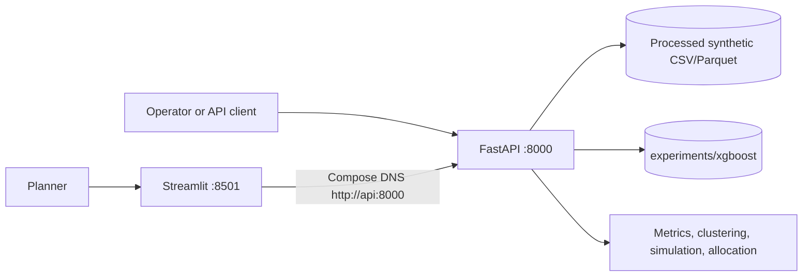

# BDS-06 Final Capstone Report

**Project:** Campus Occupancy Forecasting with Spatiotemporal Analytics and Capacity Optimization  
**Project code:** BDS-06  
**Programme:** T.Y. B.Sc. Data Science, Semester V  
**Evidence snapshot:** 2026-10-01  
**Format:** Markdown report content for blackbook formatting. This is not an exported Word/PDF artifact.

## Abstract

BDS-06 is a modular campus occupancy analytics prototype using synthetic room, timetable, event, and hourly occupancy data. The system includes data validation and cleaning, utilization metrics, one-hour XGBoost inference, room clustering, what-if simulation, capacity allocation, a FastAPI API, and a Streamlit dashboard. Forecast evaluation uses chronological holdout data and historical baselines. The local Docker Compose stack was built and started, its health/readiness and dashboard-to-API communication were verified, and a down/rebuild/start cycle passed.

Evidence does not establish performance on real campus sensor data or stakeholder acceptance. The served model supports a one-hour point estimate only; prediction intervals are not calibrated. In one allocation instance, greedy and CBC MILP were both feasible with equal objective values. The project is a verified local capstone prototype, not a production service or evidence of real campus savings.

## 1. Industry Problem

Room assignment based on nominal enrollment and timetables does not necessarily represent observed usage. Facilities planners may benefit from aggregated occupancy, capacity-use metrics, and short-term room forecasts when reviewing space needs. BDS-06 demonstrates these analyses on a safely simulated dataset.

No real campus field observations or stakeholder interviews are recorded in this workspace. The problem statement and personas in the requirements document are project framing and illustrative design inputs, not verified research participants.

### Current Workflow and Pain Points

The original problem framing describes scheduling from nominal enrollment and limited visibility into actual usage. No institutional timetable audit, facilities interview, or paper-survey sample is present, so these are validation hypotheses rather than measured current-process findings. The prototype replaces manual inspection for the demo with read-only scope metrics and a one-hour room forecast; it does not integrate with an institution's scheduling platform or issue operational room-change recommendations.

## 2. Stakeholders and Intended Users

- **Facilities/space planner:** inspect campus, building, and room utilization; review a one-hour room forecast.
- **Academic scheduler:** consider capacity-compatible room assignment comparisons.
- **Technical operator:** run Compose, check health/readiness, inspect logs, and manage local credentials.
- **Academic evaluator:** review data provenance, leakage controls, baselines, software structure, and limitations.

These roles are design personas, not results of a documented user study.

## 3. Objectives and Scope

The portfolio requires a working prototype integrating occupancy preparation, metrics, forecasting, clustering, scenario simulation, dashboard, optimization, security, evaluation, and reproducibility. The startup MVP presents a narrower read-only dashboard workflow.

### Verified current scope

- Health/readiness, authenticated metrics and forecast API routes.
- Streamlit Overview and Forecast Explorer pages.
- Synthetic checked-in processed artifacts and XGBoost one-hour artifact.
- API endpoints and offline artifacts for room clustering, what-if simulation, and heuristic-versus-MILP allocation.
- Two-service Docker Compose runtime.

### Not established as current capability

- Live campus sensor or timetable service integration.
- Multi-horizon forecast serving or calibrated p10/p50/p90 intervals.
- Geographic heatmap, prediction uncertainty visualization, or optimizer/simulation/clustering/SHAP dashboard pages.
- Real-user study, production hosting, institutional privacy approval, or measured real-world energy/cost savings.

### Functional and Non-Functional Status

| Requirement area | Current implementation/evidence | Status |
| --- | --- | --- |
| Timetable/data integration | File ingestion/harmonization code and processed timetable; no live timetable-system connector | Partial |
| Cleaning/validation | Synthetic data validation and cleaning modules; saved snapshot has 0 errors/warnings | Implemented for checked-in data; real-source behavior unvalidated |
| SUR/RFU/WSH | Formula code, tests, campus/building/room API calls | Verified locally |
| Forecasting | XGBoost one-hour point estimate, chronological holdout | Verified for one-hour scope; multi-horizon/quantiles unsupported |
| Clustering/scenario/optimization | API/offline code and artifacts | Implemented; limited experiment coverage and not in dashboard UX |
| Auth/PII/error handling | API-key permissions, input checks, safe errors, tests and live 401/403 behavior | Verified locally for tested paths |
| Reproducible Docker launch | Compose build, start, health, dashboard/API, and restart cycle | Verified locally; not production-hosted |
| NFR-01 forecast p95 <= 200 ms | 20 warmed Compose-DNS calls: p95 157.95 ms, max 544.25 ms | Meets threshold in this small sample only |
| NFR-02 solver <= 45 s at 100-room scale | One 50-assignment run about 1.73 s | 100-room threshold not tested |
| NFR-07 coverage >= 85% | Existing `coverage.xml` snapshot reports an 86.48% line rate; current handoff did not rerun coverage | Previously recorded; not freshly recomputed |
| NFR-08 container portability | Local Windows/WSL 2 runtime passes | Cross-host identical behavior not verified |

## 4. Data and Provenance

The checked-in dataset is generated synthetically with seed 42. The processed snapshot contains 86,016 hourly occupancy observations, 32 rooms, and 50 timetable records, with room and event data. The saved validation report records zero validation errors and warnings for this snapshot.

The data generator encodes assumptions about room capacity, timetable status, calendar events, attendance, and anomalies. It is not measured campus behavior. No external dataset license is claimed. A real institutional dataset would require documented permission, provenance, retention rules, and privacy review.

## 5. Architecture

The implementation is a modular Python monolith. FastAPI provides the service/API boundary; Streamlit is a separate Compose service using a typed API client.

| Module | Responsibility |
| --- | --- |
| `app/data` | ingestion, validation, cleaning, harmonization |
| `app/features` | temporal, schedule, room, lag, and rolling features |
| `app/forecasting` | historical baselines, XGBoost serving, evaluation |
| `app/analytics` | SUR, RFU, WSH and forecast explainability utilities |
| `app/clustering` | aggregate room profiles and K-Means |
| `app/simulation` | occupancy/enrollment multipliers, room closure, capacity adjustments |
| `app/optimization` | capacity-first greedy baseline and PuLP/CBC allocation |
| `app/api` | health, metrics, forecast, clustering, simulation, optimization routes |
| `app/dashboard` | API client, Overview, Forecast Explorer |

The existing architecture document includes earlier aspirational diagrams and stale folder paths; use this section and the current source tree as the deployed implementation description.

### Data Flow and Contracts

1. The seeded generator produces room, timetable, event, and hourly occupancy tables.
2. Validation/cleaning writes processed Parquet/CSV tables under `data/processed/`.
3. Training/evaluation scripts write model, metadata, metrics, and prediction artifacts under `experiments/`.
4. FastAPI loads processed data and `experiments/xgboost` artifacts using configured settings.
5. Streamlit calls health/readiness, metrics, model-info, and forecast routes through `app/dashboard/api_client.py` over Compose DNS.

The principal data contracts are described by Pydantic schemas in `app/schemas/forecast.py`, `health.py`, `metrics.py`, and related modules. Room master fields include room/building IDs, capacity, type, floor, and equipment/accessibility flags; occupancy rows include timestamp, room ID, capacity, schedule/enrollment, and aggregate actual headcount; timetable rows include course/session ID, day, interval, room, and enrollment. The forecast endpoint accepts room IDs, confidence-level fields, and a one-hour horizon; the current served model remains point-estimate-only.

## 6. Data Preparation and Feature Engineering

Validation and cleaning code supports schema checks, deduplication, timestamp reconciliation, occupancy clamping/imputation flags, and quarantine paths for invalid references/timestamps. The saved generated dataset needed no corrections or quarantine, so those error paths are supported by code/tests but were not exercised by this particular data audit.

The feature metadata lists 48 features: calendar/cyclical values, schedule and enrollment context, event indicators, room/building attributes, causal lags, rolling summaries, and derived ratios. The model split is chronological:

| Partition | Date range | Rows |
| --- | --- | ---: |
| Train | 2026-08-03 to 2026-10-11 | 53,760 |
| Validation | 2026-10-12 to 2026-10-25 | 10,752 |
| Test | 2026-10-26 to 2026-11-22 | 21,504 |

Regression tests cover temporal boundaries and causal feature behavior. The full recorded test suite also includes API, cleaning, optimization, and security cases.

## 7. Forecasting Method and Evaluation

The serving artifact is `xgboost.XGBRegressor`, seed 42, 48 features, and a one-hour horizon. It is a squared-error point regressor. The forecast API returns `interval_method=point_estimate_only`; it does not produce calibrated quantiles.

### Chronological holdout results

| Model | MAE | RMSE | R2 | WAPE | sMAPE |
| --- | ---: | ---: | ---: | ---: | ---: |
| Historical seasonal profile | 2.5975 | 10.1839 | 0.2335 | 102.72% | 163.6674% |
| XGBoost | 1.2775 | 4.3961 | 0.8572 | 50.52% | 155.5725% |

On this synthetic test set, XGBoost's MAE is 50.82% lower and RMSE 56.83% lower than the champion historical seasonal profile. These are descriptive sample comparisons; confidence intervals and significance tests are absent. MAPE is not reported because the implemented evaluation artifact does not provide it. WAPE/sMAPE are high in the presence of many low/zero target values.

Error slicing reports 69.11% MAE reduction in defined day-peak hours, but 4.66% degradation in the night slice and 9.04% degradation on Sunday. These are forecast error results, not peak-event detection metrics.

## 8. Utilization Metrics

For valid-capacity observations:

- **SUR:** sum of observed headcount divided by summed capacity.
- **RFU:** occupied operating slots divided by available operating room-hours.
- **WSH:** sum of positive `scheduled_enrollment - actual_headcount` multiplied by slot duration.
- **Peak occupancy:** maximum observed headcount in the requested slice.

Compose API runtime tests passed for campus, building `B01`, and room `B01-R101`. One captured campus response contained `observations=50,176`, SUR 0.025218, RFU 0.423988, WSH 31,402 seat-hours, and peak 220. The API's `observations` field is its estimated available-slot denominator for RFU, not row count; the processed occupancy table contains 86,016 rows. These are synthetic example values.

## 9. Room Clustering

The saved seeded K-Means run profiles five dimensions: capacity, mean utilization, peak utilization, occupancy standard deviation, and off-peak utilization. It covered 32 rooms, selected 6 clusters, and produced silhouette 0.4378954459. There is one saved run; no repeated-run stability or planner interpretation study was carried out.

## 10. Scenario Simulation

The stored scenario used occupancy multiplier 1.15, enrollment multiplier 1.10, and closed `B01-R101`. The saved offline artifact from 2026-09-27 reports WSH delta -1543.6, SUR delta +0.002845, RFU delta -0.008475, and peak occupancy delta +33. A live API execution on 2026-10-01 returned WSH -1543.6, SUR +0.002174, RFU -0.008475, peak +33 with the same parameter signature. The SUR discrepancy remains unresolved; these two SUR values must not be presented as one reconciled result. In both results, lower WSH coexists with higher peak occupancy, so the scenario is a tradeoff rather than an overall improvement.

## 11. Constraint-Aware Optimization and Baseline

The greedy baseline orders sessions by enrollment descending and places each into the smallest suitable non-overlapping room. The CBC MILP minimizes unused seats and enforces one room per session, capacity eligibility, room type when specified, and no overlap in a room. Travel distance, equipment, and accessibility constraints in the broad SRS are not all implemented.

A live Compose comparison on the checked-in 50-session timetable found:

| Method | Feasible | Status | Objective (unused seats) | Runtime |
| --- | --- | --- | ---: | ---: |
| Capacity-first greedy | Yes | Greedy | 187 | Baseline method |
| CBC MILP | Yes | Optimal | 187 | 1.73 s in this run |

The persisted experiment records MILP objective 187.0 and runtime 1.199315 s. This single data instance shows equal objective values; it does not show MILP superiority. The SRS 45-second threshold concerns a 100-room workload, which was not measured here.

## 12. API and Dashboard

Verified endpoint examples:

- `GET /api/v1/health`
- `GET /api/v1/health/live`
- `GET /api/v1/health/ready`
- `GET /api/v1/metrics/utilization?scope=campus`
- `GET /api/v1/metrics/utilization?scope=building&building_id=B01`
- `GET /api/v1/metrics/utilization?scope=room&room_id=B01-R101`
- `GET /api/v1/forecast/model/info`
- `GET /api/v1/forecast/predict/B01-R101?horizon_hours=1`
- `GET /api/v1/clustering/rooms`
- `POST /api/v1/simulation/run`
- `POST /api/v1/optimize/compare`

Protected routes require `X-API-Key`. Clustering/simulation use read permission; optimizer comparison requires optimization permission. Exact schemas are in `app/schemas/` and OpenAPI is served at `/docs` when debug/docs are enabled.

The live API examples in this report use documented query/body fields only. Scenario requests accept `occupancy_multiplier`, `enrollment_multiplier`, `closed_rooms`, and `capacity_adjustments`; allocation comparison is a body-free POST to `/api/v1/optimize/compare`. Detailed schemas and error contracts should be checked in the running `/docs` page before integrating another client.

The dashboard exposes Overview and Forecast Explorer only. AppTest showed readiness and real API-backed KPIs without exceptions; valid forecast showed model/time metadata; unknown room showed a safe inline error. No final browser screenshot, accessibility audit, or formal usability study exists.

## 13. Security, Privacy, and Failure Handling

API keys are checked by permission. Dashboard read key is distinct from the master key. Live tests observed 401 for missing/invalid credentials and 403 when the read key attempted optimizer access. Health/ready endpoints remain available for probes. API responses include request IDs and security headers. Configured PII-like source columns are rejected at ingestion.

Limitations: static keys, development fallbacks/debug settings in Compose, in-memory rate limiting, no production identity provider, no dependency vulnerability scan, and no institutional privacy/security sign-off. Use synthetic data and do not expose the development stack to untrusted networks.

## 14. Testing and Operations

Latest recorded full Python suite: 176 passed, 0 failed, 643 warnings; latest duration 45.87 seconds. The existing `coverage.xml` snapshot reports an 86.48% line rate; it was not recomputed during this handoff. `.github/workflows/ci.yml` configures CI, but no remote workflow run is evidenced. This workspace has no `.git` metadata; commits, branches, PRs, and code reviews cannot be verified.

On 2026-10-01, Docker Engine 29.8.1 / Desktop 4.93.0 / Compose 5.5.1 were verified. `docker compose config --quiet` exited 0; image build, exact `docker compose up --build -d`, API health/readiness, dashboard, API network calls, auth, metrics, forecast, artifact resolution, log scan, and down/rebuild/start all passed. Containers had zero restarts.

A warmed 20-call Compose-DNS APIClient forecast sample recorded p50 138.29 ms, nearest-rank p95 157.95 ms, and max 544.25 ms. The NFR-01 p95 target is 200 ms; this small local sample is not production certification. An additional host PowerShell sample had a 245.6 ms tail including client/shell overhead and is not treated as server-side timing.

## 15. Evaluation Dossier Summary

| Metric/evidence | Result | Threshold/status | Limitation |
| --- | --- | --- | --- |
| Forecast MAE/RMSE | XGBoost 1.2775 / 4.3961; baseline 2.5975 / 10.1839 | Descriptive comparison; no acceptance threshold defined in BDS-06 brief | Synthetic data; no CI/significance interval. |
| Utilization metrics | Campus/building/room endpoints returned 200 | Mathematical fixture tests exist; no real campus target threshold | Synthetic data, no stakeholder acceptance. |
| Peak detection | No precision/recall artifact found | Not measured | Day-peak forecast MAE slice is not a peak detector. |
| Scenario stability | One stored run and one live call; same parameters, SUR delta differs | No repeated-run threshold defined | SUR discrepancy unresolved; do not consolidate. |
| Visualization/usability | Existing forecast plots; Streamlit AppTest smoke evidence | UX spec includes five-second and responsive goals; no formal usability pass | No final UI screenshot or human study. |
| API latency | Internal 20-call p95 157.95 ms; max 544.25 ms | NFR-01 p95 <=200 ms: met in this small sample only | One local Docker host, synthetic data, small sample. |
| Optimization runtime | CBC 1.73 s on 50 assignments | NFR-02 <=45 s for 100-room standard workload: not tested | Workload differs from requirement benchmark. |
| Security cases | 401, 403, 422, safe 404 UI; no key/traceback/ERROR in inspected logs | Relevant API tests pass | No penetration or vulnerability scan. |
| Leakage | Chronological split and causal tests | Existing tests passed | Tested invariants only. |

## 16. Risks, Limitations, and Future Work

- Validate with real stakeholders and approved campus data before operational use.
- Add calibrated prediction intervals and evaluate horizons beyond one hour.
- Reconcile the persisted/live scenario SUR delta discrepancy.
- Add repeated-run scenario/clustering stability, formal peak detection, and real usability testing.
- Expand optimization constraints only where requirements and reliable input fields support them; compare objective values on multiple documented cases.
- Pin exact dependency versions, reduce image size, and define a production deployment profile before public hosting.
- Obtain actual individual contribution hours, institutional sign-off, recorded demo, and Word/PDF/presentation exports.

## 17. Reproducibility and Handoff

See `docs/runbook.md`, `docs/runbook_api_examples.md`, `docs/administrator_guide.md`, `docs/user_guide.md`, `docs/demo_script.md`, `docs/presentation_deck.md`, `docs/model_system_card.md`, and `docs/bds06_evidence_matrix.md`. Human-owned contribution records and the actual recording/export must be completed by the student; they are not inferred by this report.
