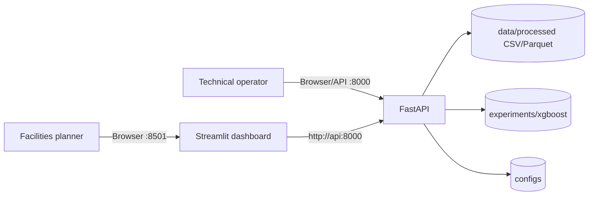

# BDS-06 Solution Design Pack (Current Implementation)

**Status date:** 2026-10-01  
**Architecture:** Modular Python monolith; FastAPI API; Streamlit dashboard; Docker Compose local runtime.  
**Design authority:** This document describes the current implementation. The broader target architecture and requirements remain in `02_architecture.md` and `01_requirements.md` with status tracked in the evidence matrix.

## 1. System Context

The dashboard contains Overview and Forecast Explorer only. It does not read model/data paths directly; it calls `app/dashboard/api_client.py`. API and dashboard run as the `api` and `dashboard` Compose services on a shared bridge network.

## 2. Components and Responsibilities

| Component | Current responsibility |
| --- | --- |
| `app/data/ingestion.py` | Parse supported structured input formats and enforce configured PII-column boundaries |
| `app/data/validation.py`, `cleaning.py` | Dataset validation, correction flags, cleaning, and quarantine handling |
| `app/data/harmonizer.py` | Align timetable/events with occupancy timestamps |
| `app/features/engineering.py` | Calendar, schedule, room, causal lag, and shifted rolling features |
| `app/forecasting/model.py` and `forecast.py` | Load XGBoost artifact and serve one-hour point predictions |
| `app/analytics/metrics.py` | Aggregate SUR, RFU, WSH, peak occupancy |
| `app/clustering/cluster.py` | Room behavior profiles and deterministic K-Means run |
| `app/simulation/simulator.py` | Occupancy/enrollment multipliers, room closures, capacity adjustments |
| `app/optimization/heuristics.py`, `solver.py` | Capacity-first greedy baseline and PuLP/CBC unused-capacity MILP |
| `app/api/routes/` | Health, data, metrics, forecast, clustering, simulation, optimization HTTP boundary |
| `app/dashboard/` | Typed API client and read-only overview/forecast pages |

## 3. Data Contracts

### Processed room master

`room_id`, `building_id`, `building_name`, `floor`, `room_type`, `capacity`, `has_projector`, `has_ac`, `has_computers`, `is_accessible`.

### Timetable

`timetable_id`, course fields, `day_of_week`, `start_time`, `end_time`, `room_id`, `enrolled_count`, and `room_type_required`. Actual required columns are enforced in `app/data/validation.py` and solver inputs.

### Occupancy

Aggregate room-time observations contain `observation_id`, `timestamp`, `date`, `hour`, `day_of_week`, `room_id`, `capacity`, `is_scheduled`, `scheduled_enrollment`, and `actual_headcount`; the processed artifact also has schedule/event/cleaning fields used by the model.

### Forecast

`ForecastRequest` supports non-empty room IDs, a one-hour horizon, optional ISO start time in batch requests, and confidence-level fields for schema compatibility. The current XGBoost model is a point regressor; the API response explicitly reports `interval_method=point_estimate_only`. Do not describe those equal point values as calibrated p10/p50/p90 uncertainty.

### Utilization response

`GET /api/v1/metrics/utilization` returns scope identifiers, SUR/RFU/WSH/peak, an `observations` denominator, requested time window, and source timestamp. The `observations` value is the available-slot denominator used by RFU (computed from distinct dates, room count, and configured operating hours/window), not occupancy-row count. With arbitrary start/end filters it remains an operating-hours estimate per included date rather than an exact interval-slot count. The endpoint returns aggregates, not raw telemetry rows.

## 4. API Surface

| Method/path | Auth | Purpose |
| --- | --- | --- |
| `GET /api/v1/health` | Public | Basic service health |
| `GET /api/v1/health/live` | Public | Liveness |
| `GET /api/v1/health/ready` | Public | Data/model readiness |
| `GET /api/v1/health/detailed` | Read key | Detailed dependency checks |
| `GET /api/v1/metrics/utilization` | Read key | Campus/building/room aggregate metrics |
| `GET /api/v1/forecast/model/info` | Forecast/read key | Model metadata |
| `GET /api/v1/forecast/predict/{room_id}` | Forecast/read key | One-room one-hour forecast |
| `POST /api/v1/forecast/predict` | Forecast/read key | Batch schema; current artifact supports one-hour only |
| `GET /api/v1/clustering/rooms` | Read key | Room profiles and cluster labels |
| `POST /api/v1/simulation/run` | Read key | Aggregate what-if simulation |
| `POST /api/v1/optimize/compare` | Optimize key | Greedy vs CBC comparison |

OpenAPI is available at `/docs` in the verified development configuration. Actual response schemas are the Pydantic models under `app/schemas/` and route definitions under `app/api/routes/`.

## 5. UX Design and States

The dashboard's only destinations are Overview and Forecast Explorer. Overview presents service readiness, scope, time filters, SUR/RFU/WSH, and an aggregate density bar. Building and room identifiers are typed manually. Forecast Explorer accepts one room and a fixed one-hour horizon, shows model/readiness, a single point, timestamp, and safe errors. The API response does not supply a capacity field or calibrated interval for the chart.

AppTest evidence covers ready KPI rendering and a valid/unknown-room forecast. No formal user study, accessibility audit, narrow viewport review, or final screenshot is claimed.

## 6. Threat Model and Controls

| Threat/misuse | Control observed | Residual risk |
| --- | --- | --- |
| Missing/invalid API key | Protected route returns 401 | Static keys; no identity provider |
| Read user attempts optimizer | Permission boundary returns 403 | Development-only static key setup |
| PII-bearing ingestion | Configured PII-like columns rejected | No institutional privacy assessment |
| Invalid room/horizon/dependency | Structured 404/422/503 behavior; safe dashboard messages | Not exhaustive fuzzing/penetration testing |
| Secret leakage to logs | Inspected runtime log tail contains no read key | Only one local log sample; no external log platform |
| DoS/repeated requests | Configurable in-memory rate limiting | Process-local state; not a distributed limiter |
| Synthetic forecast mistaken as real | Labels/limitations in report and guides | Presenter must state synthetic scope |

Development fallback values and `DEBUG=true` are not production configuration. Compose exposes ports on all interfaces; do not run the development stack on an untrusted network.

## 7. Test Strategy and Evidence

- Unit tests for cleaning, schemas, metrics, feature engineering, and solver invariants.
- Integration/API tests for health, auth, metrics, forecast, errors, and OpenAPI.
- Regression leakage tests for temporal ordering and causal features.
- Current recorded whole suite: 176 passed, 0 failed, 643 warnings; the existing `coverage.xml` snapshot reports 86.48% line rate and was not regenerated in Task 3.3.
- CI workflow configuration exists in `.github/workflows/ci.yml`; remote run results are not available because there is no Git metadata in this workspace.
- Docker Compose runtime and rebuild/restart were verified locally on 2026-10-01.
